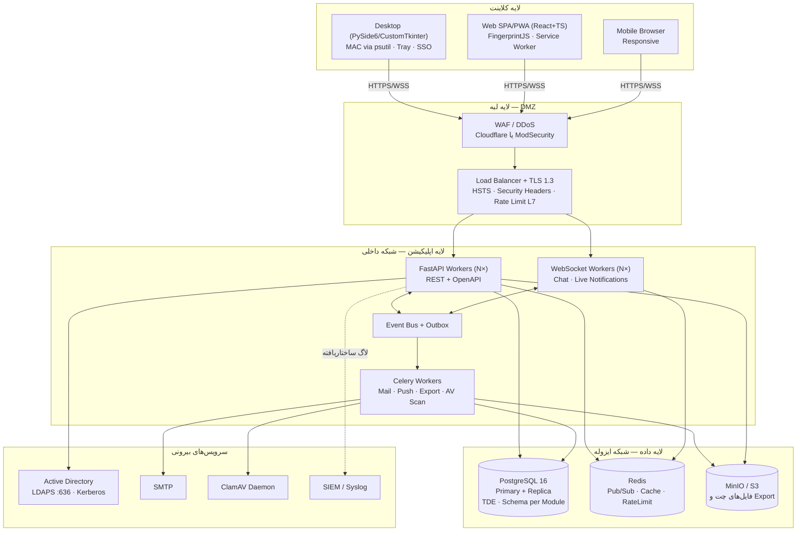
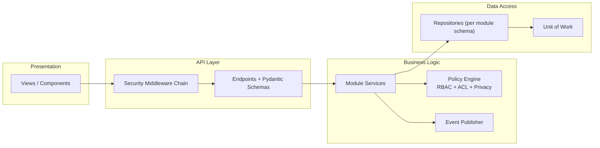
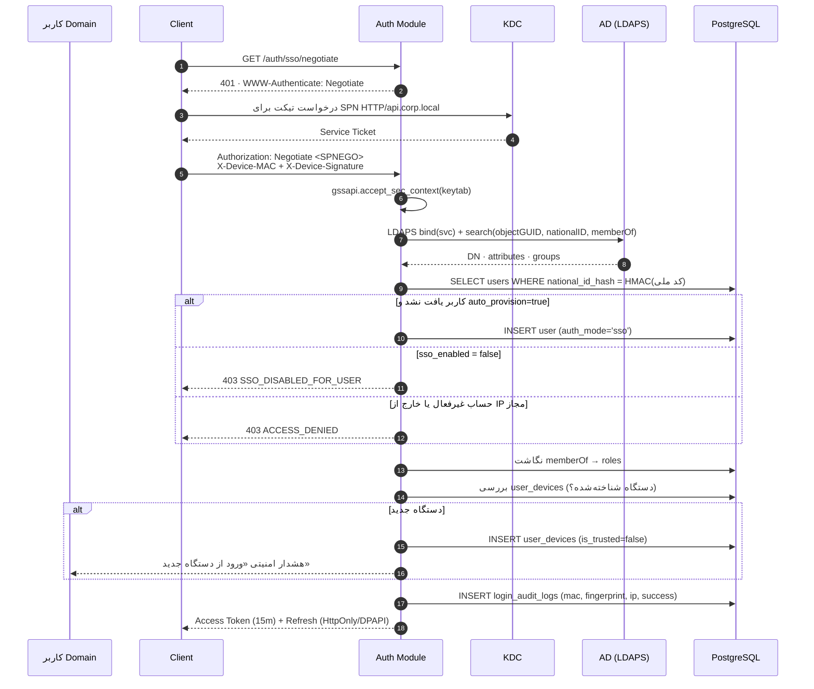
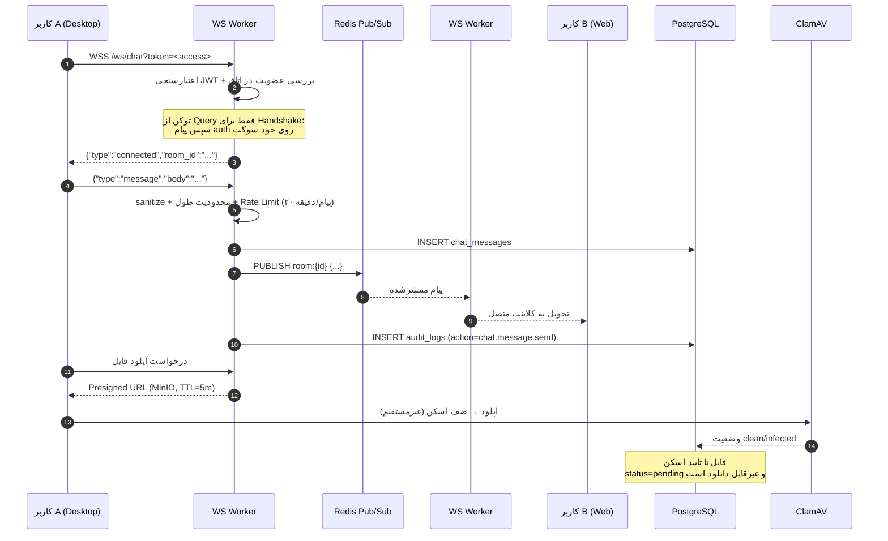
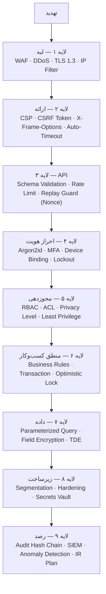
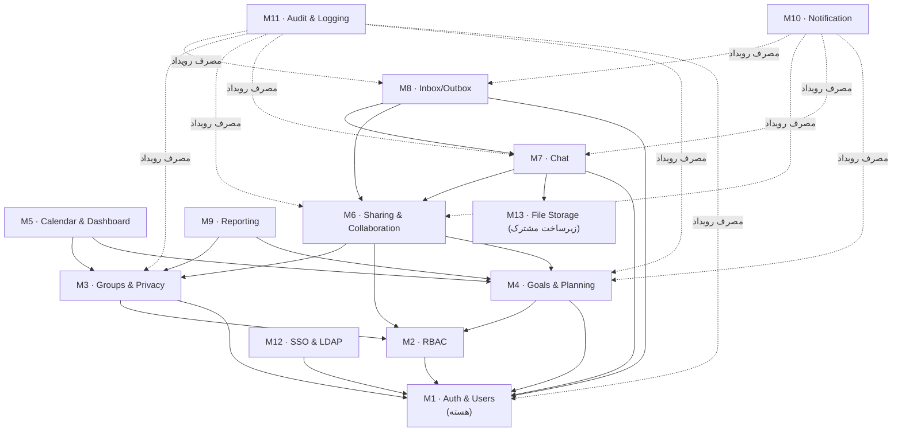
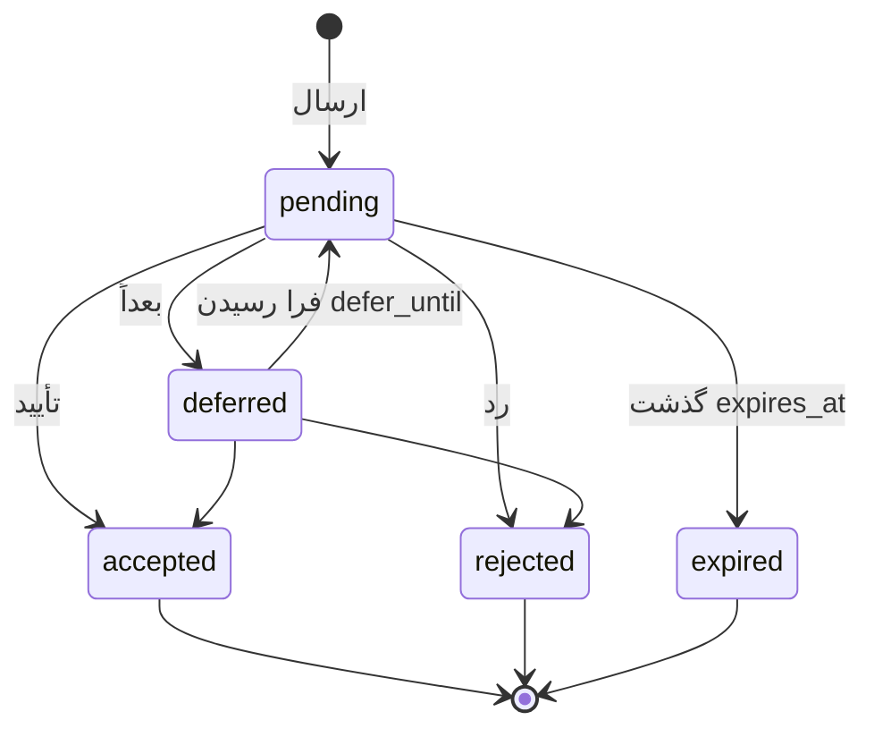

# سند معماری جامع — نسخه ۲.۰
## سامانه سازمانی مدیریت اهداف، برنامه‌ریزی و همکاری

**نسخه:** 2.0 | **تاریخ:** ۲۷ شهریور ۱۴۰۵ | **جایگزین نسخه ۱.۰**
**نویسنده:** معماری ارشد سیستم و امنیت نرم‌افزار | **رویکرد:** Security-First · Defense in Depth · Zero Trust

---

## فهرست

| # | بخش |
|---|-----|
| ۰ | [تغییرات نسبت به نسخه ۱ و تصمیم‌های کلیدی](#۰-تغییرات-نسبت-به-نسخه-۱-و-تصمیمهای-کلیدی) |
| ۱ | [معماری سطح بالا و نمودارها](#۱-معماری-سطح-بالا-و-نمودارها) |
| ۲ | [معماری ماژولار و قرارداد بین ماژول‌ها](#۲-معماری-ماژولار-و-قرارداد-بین-ماژولها) |
| ۳ | [ساختار پوشه‌های پروژه](#۳-ساختار-پوشههای-پروژه) |
| ۴ | [طراحی دیتابیس](#۴-طراحی-دیتابیس) |
| ۵ | [طراحی API](#۵-طراحی-api) |
| ۶ | [استراتژی MAC Address و شناسایی دستگاه](#۶-استراتژی-mac-address-و-شناسایی-دستگاه) |
| ۷ | [RBAC، گروه‌ها و حریم خصوصی](#۷-rbac-گروهها-و-حریم-خصوصی) |
| ۸ | [چت، WebSocket و مدیریت فایل](#۸-چت-websocket-و-مدیریت-فایل) |
| ۹ | [کارتابل](#۹-کارتابل-inboxoutbox) |
| ۱۰ | [شخصی‌سازی داشبورد و ویجت‌ها](#۱۰-شخصیسازی-داشبورد-و-ویجتها) |
| ۱۱ | [استراتژی امنیت جامع](#۱۱-استراتژی-امنیت-جامع) |
| ۱۲ | [نمونه کد (Boilerplate)](#۱۲-نمونه-کد-boilerplate) |
| ۱۳ | [کتابخانه‌ها، زیرساخت و ظرفیت‌سنجی](#۱۳-کتابخانهها-زیرساخت-و-ظرفیتسنجی) |
| ۱۴ | [فازبندی، ریسک و توصیه‌های پایانی](#۱۴-فازبندی-ریسک-و-توصیههای-پایانی) |

---

## ۰. تغییرات نسبت به نسخه ۱ و تصمیم‌های کلیدی

### ۰.۱ دامنه‌ی افزوده‌شده

نسخه ۲ نیازمندی‌ها هفت حوزه‌ی کاملاً جدید اضافه کرده است: **RBAC چندنقشی**، **گروه‌های کاربری سلسله‌مراتبی با حریم خصوصی**، **اتاق گفتگوی Real-time با WebSocket و اشتراک فایل**، **کارتابل ورودی/ارسالی**، **MFA و امنیت پیشرفته ورود**، **Audit Log مبتنی بر MAC Address و Device Fingerprint**، و **ویجت‌ها و داشبورد کاملاً قابل شخصی‌سازی**. همچنین شناسه‌ی یکتای کاربران از نام کاربری به **کد ملی** تغییر کرده است.

این‌ها دامنه را تقریباً **دوبرابر** می‌کنند. بخش ۱۴ اثر آن بر زمان‌بندی را صریح بیان می‌کند.

### ۰.۲ تصمیم‌های کلیدی معماری (ADR)

| # | تصمیم | انتخاب | دلیل |
|---|-------|--------|------|
| ADR-01 | سبک معماری | **Modular Monolith با مرزهای اجباری** — نه Microservices | جزئیات در ۰.۳ |
| ADR-02 | ارتباط بین ماژول‌ها | **Event Bus درون‌پروسه‌ای + Outbox Pattern** | رویدادمحور بودن بدون هزینه‌ی شبکه؛ مسیر مهاجرت بعدی به صف پیام باز می‌ماند |
| ADR-03 | فریم‌ورک | **FastAPI** + Uvicorn | async بومی برای WebSocket، LDAP و Push؛ OpenAPI خودکار؛ Pydantic اجباری |
| ADR-04 | دیتابیس | **PostgreSQL 16** با یک Schema به‌ازای هر ماژول | جداسازی منطقی ماژول‌ها بدون تقسیم فیزیکی دیتابیس |
| ADR-05 | WebSocket | **FastAPI WebSocket + Redis Pub/Sub** | مقیاس‌پذیری افقی: پیام روی هر Worker منتشر می‌شود |
| ADR-06 | شناسه‌ی کاربر | کد ملی **رمزنگاری‌شده (AES-GCM) + هش جستجوپذیر (HMAC-SHA256)** | کد ملی داده‌ی هویتی حساس است؛ ذخیره‌ی plaintext غیرقابل دفاع است |
| ADR-07 | MFA | **TOTP اولویت اول**؛ Email دوم؛ **SMS فقط به‌عنوان آخرین گزینه** | SMS در برابر SIM-Swap آسیب‌پذیر است (NIST SP 800-63B آن را "restricted" می‌داند) |
| ADR-08 | MAC Address | **سیگنال کمکی Forensic** — نه کنترل امنیتی | جزئیات و دلایل در بخش ۶ |
| ADR-09 | ذخیره‌سازی فایل | **S3-compatible (MinIO)** با آدرس‌دهی محتوایی | جداسازی کامل فایل از Web Root؛ آماده برای چند سرور |
| ADR-10 | Audit | **Append-Only + زنجیره‌ی هش (Hash Chain)** به‌جای امضای تک‌رکوردی | تشخیص حذف رکورد، نه فقط تغییر آن |
| ADR-11 | حریم خصوصی | **Privacy Level به‌عنوان یک لایه‌ی مستقل روی ACL** | دسترسی و حریم خصوصی دو مفهوم متفاوت‌اند؛ ادغام آن‌ها منشأ نشت داده است |

### ۰.۳ چرا Microservices توصیه نمی‌شود (مهم)

نیازمندی «معماری Microservices» ذکر شده است. توصیه‌ی فنی من **Modular Monolith** است و دلایل آن را صریح می‌گویم، چون این تصمیم بیش از هر تصمیم دیگری بر موفقیت یا شکست پروژه اثر دارد:

**آنچه Microservices واقعاً از شما می‌خواهد:** ۱۲ مخزن مستقل، ۱۲ خط لوله CI/CD، Service Discovery، API Gateway، تراکنش‌های توزیع‌شده (Saga) برای عملیاتی مثل «ایجاد جلسه + دعوت کاربران + ساخت اتاق چت + ارسال کارتابل»، ردیابی توزیع‌شده، مدیریت نسخه‌ی قرارداد بین سرویس‌ها، و یک تیم SRE. برای سامانه‌ای با **حداکثر ۱۰۰۰ کاربر همزمان** — که یک نمونه‌ی PostgreSQL به‌راحتی پاسخ می‌دهد — این هزینه هیچ توجیه فنی ندارد.

**هزینه‌ی واقعی:** یک کوئری ساده مثل «داشبورد مدیر گروه» که در Monolith یک JOIN است، در Microservices به ۴ فراخوانی شبکه بین سرویس‌های User، Group، Goal و Privacy تبدیل می‌شود — با احتمال شکست جزئی، نیاز به Circuit Breaker، و p95 چند برابر.

**راه‌حل پیشنهادی که هر دو هدف را برآورده می‌کند:**

- هر ماژول یک پکیج پایتون مستقل با `__init__.py` که **فقط رابط عمومی** را صادر می‌کند.
- هر ماژول Schema اختصاصی در PostgreSQL دارد؛ **دسترسی مستقیم به جدول ماژول دیگر ممنوع** و با آزمون خودکار معماری بررسی می‌شود.
- ارتباط فقط از دو راه: فراخوانی رابط عمومی (`ports/`) یا انتشار رویداد روی Event Bus.
- هر ماژول تست مستقل و مستندات API خودش را دارد.
- استقرار واحد، اما **قابلیت جدا شدن هر ماژول به سرویس مستقل در آینده بدون بازنویسی منطق** — چون وابستگی‌ها از قبل از طریق رابط عبور می‌کنند.

این دقیقاً «قابلیت واگذاری به تیم‌های مستقل» را می‌دهد (هدف اصلی شما) بدون پرداخت هزینه‌ی عملیاتی توزیع‌شدگی. اگر بعداً یک ماژول خاص — مثلاً چت — به مقیاس مستقل نیاز پیدا کرد، همان ماژول به‌تنهایی استخراج می‌شود.

```python
# tests/architecture/test_module_boundaries.py
FORBIDDEN = [
    ("modules.chat",    "modules.goals.db"),      # چت نباید مستقیم به جداول اهداف بزند
    ("modules.goals",   "modules.chat.db"),
    ("modules.inbox",   "modules.groups.db"),
    # ... ماتریس کامل
]

@pytest.mark.parametrize("importer,forbidden", FORBIDDEN)
def test_no_cross_module_db_access(importer, forbidden):
    """مرز ماژول‌ها با آزمون اجباری می‌شود، نه با توافق شفاهی."""
    violations = scan_imports(importer, matching=forbidden)
    assert not violations, f"نقض مرز ماژول: {violations}"
```

بدون این آزمون، «معماری ماژولار» ظرف شش ماه به یک Monolith درهم‌تنیده تبدیل می‌شود — این قاعده‌ای است که تقریباً بدون استثنا رخ می‌دهد.

---

## ۱. معماری سطح بالا و نمودارها

### ۱.۱ نمودار Client-Server



**سه ناحیه‌ی شبکه‌ای (Network Segmentation):** DMZ فقط ۴۴۳ را از اینترنت/LAN می‌پذیرد؛ لایه‌ی اپلیکیشن فقط از DMZ ترافیک می‌گیرد؛ لایه‌ی داده **هیچ مسیر ورودی از بیرون ندارد** و فقط از لایه‌ی اپلیکیشن قابل دسترسی است. دسترسی مدیریتی (SSH، psql) منحصراً از طریق Bastion Host با MFA.

### ۱.۲ نمودار لایه‌ها و جریان داده



**زنجیره‌ی Middleware امنیتی** (به ترتیب اجرا):

```
RequestID → SecurityHeaders → CORS → IPFilter (allow/deny list)
  → RateLimit → BodySizeGuard → Authentication (JWT/Kerberos)
  → DeviceBinding (MAC/Fingerprint + HMAC) → SessionValidation (MFA, timeout)
  → AuditContext (ContextVar) → Router
```

هر لایه مستقل است و شکست هر یک، درخواست را قبل از رسیدن به منطق کسب‌وکار متوقف می‌کند — مصداق عملی Defense in Depth.

### ۱.۳ نمودار جریان SSO با Active Directory



**نکته‌ی حیاتی:** تیکت Kerberos **فقط برای احراز هویت اولیه** به کار می‌رود. پس از آن، JWT داخلی صادر می‌شود تا مدل مجوزدهی برای کاربران SSO و محلی یکسان بماند. نگاشت کاربر بر `objectGUID` (نه `sAMAccountName`) و کد ملی انجام می‌شود؛ نام کاربری در AD تغییرپذیر است.

### ۱.۴ نمودار WebSocket و چت Real-time



**قواعد امنیتی WebSocket:**

1. توکن در Query String فقط برای Handshake اولیه (چون مرورگر اجازه‌ی هدر سفارشی در WebSocket نمی‌دهد)؛ بلافاصله پس از اتصال، سرور یک پیام `auth` می‌خواهد و توکن Query را **در لاگ‌ها ماسک می‌کند** (Query String در لاگ Nginx ثبت می‌شود — یک نشت رایج).
2. عضویت در اتاق در **لحظه‌ی هر پیام** بررسی می‌شود، نه فقط هنگام اتصال. کاربری که از اتاق حذف شده، نباید با اتصال باز پیام بگیرد.
3. انقضای Access Token روی سوکت باز اعمال می‌شود: هر ۶۰ ثانیه اعتبار توکن بازبینی و در صورت انقضا سوکت بسته می‌شود (`4401`).
4. Rate Limiting روی سوکت مستقل از REST است.
5. Origin Check در Handshake اجباری است (WebSocket تحت CORS نیست — این یک سوءتفاهم رایج و منشأ Cross-Site WebSocket Hijacking).

### ۱.۵ نمودار معماری امنیت (Defense in Depth)



اصل حاکم: **هیچ لایه‌ای به درستی لایه‌ی قبل تکیه نمی‌کند.** اگر WAF دور زده شد، Schema Validation می‌گیرد؛ اگر آن هم رد شد، Parameterized Query جلوی تزریق را می‌گیرد؛ و اگر همه شکست خوردند، Audit Log ردپا را نگه می‌دارد.

---

## ۲. معماری ماژولار و قرارداد بین ماژول‌ها

### ۲.۱ نقشه‌ی ماژول‌ها و وابستگی‌ها



خطوط نقطه‌چین = وابستگی رویدادی (بدون وابستگی کد). **M10 و M11 هیچ ماژولی را import نمی‌کنند** — فقط رویداد مصرف می‌کنند. این باعث می‌شود افزودن یک ماژول جدید، هیچ تغییری در نوتیفیکیشن و Audit لازم نداشته باشد.

### ۲.۲ قرارداد رابط (Interface Contract)

هر ماژول سه چیز صادر می‌کند و هیچ چیز دیگری:

```python
# modules/groups/__init__.py
from .ports import GroupService, GroupReadModel      # ۱) رابط عمومی
from .events import GroupMemberAdded, PrivacyChanged  # ۲) رویدادهای منتشرشده
from .schemas import GroupPublic, MemberPublic        # ۳) DTOهای عمومی

__all__ = ["GroupService", "GroupReadModel", "GroupMemberAdded",
           "PrivacyChanged", "GroupPublic", "MemberPublic"]
```

```python
# modules/groups/ports.py — قرارداد، نه پیاده‌سازی
from typing import Protocol
from uuid import UUID

class GroupReadModel(Protocol):
    """هر ماژول دیگری فقط این را می‌بیند. تغییر امضای این متدها = تغییر شکننده."""

    async def is_member(self, user_id: UUID, group_id: UUID) -> bool: ...
    async def is_manager(self, user_id: UUID, group_id: UUID) -> bool: ...
    async def member_ids(self, group_id: UUID, include_subgroups: bool = False) -> list[UUID]: ...
    async def groups_of(self, user_id: UUID) -> list[GroupPublic]: ...
    async def effective_privacy(self, owner_id: UUID, viewer_id: UUID) -> PrivacyDecision: ...
```

ماژول Reporting برای ساخت داشبورد مدیر گروه، `GroupReadModel` را از طریق تزریق وابستگی می‌گیرد — **نه** `from modules.groups.db.models import Group`. اگر فردا ماژول گروه‌ها به سرویس مستقل تبدیل شود، فقط پیاده‌سازی `GroupReadModel` به یک HTTP Client تغییر می‌کند و Reporting دست‌نخورده می‌ماند.

### ۲.۳ Event Bus و الگوی Outbox

```python
# core/events/bus.py
@dataclass(frozen=True)
class DomainEvent:
    event_id: UUID
    event_type: str            # "goal.task.completed"
    occurred_at: datetime
    actor_id: UUID | None
    payload: dict
    correlation_id: UUID       # ردیابی یک عملیات در کل زنجیره

class EventBus:
    def subscribe(self, event_type: str, handler: Callable) -> None: ...
    async def publish(self, event: DomainEvent, session: AsyncSession) -> None:
        """رویداد در همان تراکنش منطق کسب‌وکار در جدول outbox درج می‌شود."""
        session.add(OutboxMessage.from_event(event))
```

**چرا Outbox و نه انتشار مستقیم؟** اگر تراکنش دیتابیس Rollback شود ولی رویداد قبلاً منتشر شده باشد، نوتیفیکیشنی ارسال می‌شود برای کاری که هرگز ذخیره نشد. با Outbox، رویداد و داده در یک تراکنش اتمیک ذخیره می‌شوند و یک Dispatcher جداگانه آن‌ها را با تضمین **At-Least-Once** تحویل می‌دهد. مصرف‌کننده‌ها باید Idempotent باشند (با `event_id` تکراری‌ها را رد کنند).

```sql
CREATE TABLE core.outbox_messages (
    id             BIGSERIAL PRIMARY KEY,
    event_id       UUID NOT NULL UNIQUE,
    event_type     VARCHAR(100) NOT NULL,
    payload        JSONB NOT NULL,
    correlation_id UUID,
    created_at     TIMESTAMPTZ NOT NULL DEFAULT now(),
    dispatched_at  TIMESTAMPTZ,
    attempts       SMALLINT NOT NULL DEFAULT 0,
    last_error     TEXT
);
CREATE INDEX ix_outbox_pending ON core.outbox_messages(created_at)
    WHERE dispatched_at IS NULL;
```

### ۲.۴ کاتالوگ رویدادها (بخشی)

| رویداد | ناشر | مصرف‌کننده‌ها |
|--------|------|----------------|
| `auth.login.succeeded` / `auth.login.failed` | M1 | M11 Audit، M10 Notification (ورود از دستگاه جدید) |
| `auth.device.registered` | M1 | M11، M10 (هشدار امنیتی) |
| `rbac.role.assigned` | M2 | M11 |
| `group.member.added` / `group.privacy.changed` | M3 | M11، M10، M9 (بازسازی کش داشبورد مدیر) |
| `goal.task.created` / `.completed` / `.overdue` | M4 | M5، M9، M10، M11 |
| `share.granted` / `share.revoked` | M6 | M8 (ایجاد آیتم کارتابل)، M10، M11 |
| `chat.room.created` / `chat.message.sent` / `chat.file.uploaded` | M7 | M10، M11، M13 (صف اسکن) |
| `inbox.item.acted` | M8 | M10 (Read Receipt به فرستنده)، M11 |

### ۲.۵ فازبندی و واگذاری به تیم‌ها

| فاز | ماژول‌ها | تیم | پیش‌نیاز |
|-----|----------|-----|----------|
| ۱ | M1 Auth، M2 RBAC، M12 SSO/LDAP، M11 Audit | تیم پلتفرم | — |
| ۲ | M3 Groups & Privacy، داشبورد مدیر گروه (نسخه پایه) | تیم A | فاز ۱ |
| ۳ | M4 Goals، M5 Calendar & Dashboard | تیم B | فاز ۱ |
| ۴ | M6 Sharing، M8 Inbox/Outbox | تیم A | فاز ۲، ۳ |
| ۵ | M7 Chat، M13 File Storage | تیم C | فاز ۱، ۶ (اشتراک‌گذاری) |
| ۶ | M9 Reporting، داشبورد پیشرفته | تیم B | فاز ۲، ۳ |
| ۷ | M10 Notification، بهینه‌سازی، سخت‌سازی | همه | همه |

**پیش‌شرط واگذاری موازی:** ماژول M1 و M11 باید **پیش از شروع کار موازی تیم‌ها تثبیت شوند**. تلاش برای ساخت همزمان Auth و Chat توسط دو تیم مختلف، به بازنویسی می‌انجامد — چون چت به مدل نشست و مجوز وابسته است.

---

## ۳. ساختار پوشه‌های پروژه

### ۳.۱ Backend

```
backend/
├── app/
│   ├── main.py
│   ├── core/                              # ───── زیرساخت مشترک (بدون منطق دامنه)
│   │   ├── config.py                      # Pydantic Settings از ENV
│   │   ├── security/
│   │   │   ├── hashing.py                 # Argon2id
│   │   │   ├── jwt.py                     # صدور/تأیید RS256
│   │   │   ├── crypto.py                  # AES-256-GCM (کد ملی، رمز LDAP، TOTP secret)
│   │   │   ├── searchable_hash.py         # HMAC-SHA256 برای جستجوی داده رمزنگاری‌شده
│   │   │   ├── device_binding.py          # تأیید HMAC هدر MAC/Fingerprint
│   │   │   ├── nonce.py                   # Replay Guard
│   │   │   └── totp.py                    # MFA
│   │   ├── events/{bus.py, outbox.py, dispatcher.py}
│   │   ├── db/{session.py, base.py, uow.py, mixins.py}
│   │   ├── middleware/
│   │   │   ├── request_id.py  security_headers.py  cors.py
│   │   │   ├── ip_filter.py   rate_limit.py        body_guard.py
│   │   │   ├── authentication.py  device_binding.py  session_guard.py
│   │   │   └── audit_context.py
│   │   ├── errors.py  logging.py  pagination.py  sanitizer.py
│   │   └── context.py                     # ContextVar: user, ip, mac, fingerprint, request_id
│   │
│   ├── modules/                           # ───── هر ماژول یک مرز بسته
│   │   ├── auth/
│   │   │   ├── __init__.py                # فقط رابط عمومی صادر می‌شود
│   │   │   ├── ports.py  events.py  schemas.py
│   │   │   ├── api/{routes.py, admin_routes.py, deps.py}
│   │   │   ├── services/{auth_service.py, mfa_service.py, device_service.py,
│   │   │   │             password_service.py, session_service.py}
│   │   │   ├── db/{models.py, repositories.py}   # schema: auth
│   │   │   └── tests/
│   │   ├── rbac/          # schema: rbac      — نقش، Permission، Middleware بررسی دسترسی
│   │   ├── groups/        # schema: groups    — گروه‌های سلسله‌مراتبی، حریم خصوصی
│   │   ├── goals/         # schema: planning  — اهداف، برنامه‌ها، تسک‌ها، adhoc، تگ‌ها
│   │   ├── calendar/      # schema: planning  — نماهای تقویمی، یادآورها
│   │   ├── sharing/       # schema: sharing   — ACL، انتقال مالکیت، کامنت، Activity
│   │   ├── chat/          # schema: chat      — اتاق، پیام، عضویت، آرشیو
│   │   ├── inbox/         # schema: inbox     — کارتابل ورودی/ارسالی، Read Receipt
│   │   ├── reporting/     # schema: reporting — نمودار، Export، داشبورد مدیر گروه
│   │   ├── notification/  # schema: notify    — اعلان، Push، ترجیحات
│   │   ├── audit/         # schema: audit     — audit_logs، login_audit_logs، hash chain
│   │   ├── ssoldap/       # schema: auth      — LDAP، Kerberos، نگاشت گروه
│   │   └── files/         # schema: files     — آپلود، اسکن AV، Presigned URL
│   │
│   ├── workers/
│   │   ├── celery_app.py
│   │   └── tasks/{reminders.py, emails.py, webpush.py, exports.py,
│   │              av_scan.py, outbox_dispatcher.py, audit_archive.py, ldap_sync.py}
│   └── ws/
│       ├── manager.py                     # مدیریت اتصال‌ها + Redis Pub/Sub
│       └── handlers/{chat.py, notifications.py}
│
├── alembic/versions/
├── tests/{unit, integration, security, architecture}/
├── pyproject.toml   .env.example   Dockerfile
```

### ۳.۲ Frontend دسکتاپ

```
desktop/
├── app/
│   ├── main.py                    # RTL سراسری، بارگذاری فونت، تم
│   ├── core/
│   │   ├── api_client.py          # httpx + تزریق خودکار هدرهای دستگاه
│   │   ├── device_identity.py     # MAC via psutil + Fingerprint سیستمی + امضای HMAC
│   │   ├── auth_manager.py        # login / MFA / refresh / logout
│   │   ├── token_store.py         # DPAPI + keyring
│   │   ├── sso_client.py          # requests-negotiate-sspi
│   │   ├── ws_client.py           # کلاینت WebSocket چت (روی QThread)
│   │   ├── event_bus.py           # سیگنال‌های سراسری بین ViewModelها
│   │   └── permissions.py         # کش Permission برای مخفی‌سازی UI (نه امنیت)
│   ├── viewmodels/                # login, mfa, dashboard, calendar, goal, task,
│   │                              # chat, inbox, group_manager, privacy, admin, widget
│   ├── views/
│   │   ├── main_window.py  login_window.py  mfa_dialog.py
│   │   ├── dashboard/{dashboard_view.py, grid_canvas.py, blocks/}
│   │   ├── widgets/{clock_widget.py, tag_chip.py, persian_date_picker.py,
│   │   │            avatar.py, toast.py, floating_widget_base.py}
│   │   ├── calendar/  chat/  inbox/  group_manager/  admin/  settings/
│   ├── services/{notifier.py, reminder_worker.py, jalali_service.py, layout_store.py}
│   ├── resources/{fonts/, icons/, themes/{dark.qss,light.qss}, i18n/}
│   └── utils/{rtl.py, digits.py}
└── build/planner.spec
```

### ۳.۳ Frontend وب

```
web/
├── public/{manifest.webmanifest, sw.js, icons/}
├── src/
│   ├── main.tsx                      # <html dir="rtl" lang="fa">
│   ├── api/{client.ts, generated/, queries/, ws.ts}
│   ├── security/
│   │   ├── fingerprint.ts            # FingerprintJS + هش پایدار
│   │   ├── deviceHeaders.ts          # تزریق X-Device-* + امضا
│   │   └── sanitize.ts               # DOMPurify
│   ├── features/
│   │   ├── auth/{Login, MfaChallenge, Devices, Sessions}
│   │   ├── rbac/  groups/  goals/  calendar/  sharing/
│   │   ├── chat/{RoomList, MessageStream, FileUpload, useChatSocket}
│   │   ├── inbox/{InboxView, OutboxView, ReceiptBadge}
│   │   ├── dashboard/{DashboardGrid, blocks/, useLayoutPersistence, LayoutManager}
│   │   ├── widgets/{ClockWidget, WidgetCanvas, useWidgetSettings}
│   │   ├── groupManager/  reports/  admin/{Users, BulkLoginMode, AuditLogs, Ldap}
│   ├── components/ui/                # Design System
│   ├── hooks/  store/  lib/{jalali.ts, permissions.ts}
│   ├── styles/tailwind.css           # logical properties برای RTL
│   └── types/
└── vite.config.ts  tailwind.config.ts
```

---

## ۴. طراحی دیتابیس

### ۴.۱ قراردادها

- یک **Schema به‌ازای هر ماژول** (`auth`, `rbac`, `groups`, `planning`, `sharing`, `chat`, `inbox`, `reporting`, `notify`, `audit`, `files`). کاربر دیتابیس برنامه روی هر Schema نقش جداگانه دارد؛ ماژول چت حتی در سطح دیتابیس به جداول اهداف `SELECT` ندارد.
- کلید اصلی **UUID** (ضد شمارش‌پذیری/IDOR)؛ جداول لاگ `BIGSERIAL` (حجم بالا، ترتیب زمانی).
- زمان‌ها `TIMESTAMPTZ` و **UTC**؛ تبدیل جلالی فقط در لایه‌ی نمایش.
- `version INTEGER` برای Optimistic Locking روی موجودیت‌های اشتراکی.
- `deleted_at` برای Soft Delete؛ جداول Audit **هرگز** حذف نمی‌شوند.

### ۴.۲ ماژول Auth — کاربران، کد ملی، MFA، دستگاه‌ها

```sql
CREATE SCHEMA auth;
CREATE EXTENSION IF NOT EXISTS pgcrypto;

CREATE TYPE auth.auth_mode AS ENUM ('local', 'sso', 'both');

CREATE TABLE auth.users (
    id                  UUID PRIMARY KEY DEFAULT gen_random_uuid(),

    -- ── هویت
    username            VARCHAR(64)  NOT NULL,
    national_id_enc     BYTEA        NOT NULL,   -- AES-256-GCM (کد ملی)
    national_id_nonce   BYTEA        NOT NULL,
    national_id_hash    CHAR(64)     NOT NULL,   -- HMAC-SHA256(کد ملی, PEPPER) برای جستجو
    national_id_last4   CHAR(4)      NOT NULL,   -- نمایش ماسک‌شده در UI: ******1234
    email               VARCHAR(255),
    mobile_enc          BYTEA,                   -- برای MFA پیامکی
    display_name        VARCHAR(128) NOT NULL,
    employee_code       VARCHAR(32),

    -- ── احراز هویت
    auth_mode           auth.auth_mode NOT NULL DEFAULT 'local',
    sso_enabled         BOOLEAN NOT NULL DEFAULT FALSE,
    password_hash       TEXT,                     -- Argon2id
    password_changed_at TIMESTAMPTZ,
    password_expires_at TIMESTAMPTZ,              -- سیاست ۹۰ روزه (بخش ۱۱.۳ را ببینید)
    must_change_password BOOLEAN NOT NULL DEFAULT FALSE,
    token_version       INTEGER NOT NULL DEFAULT 1,

    -- ── MFA
    mfa_enabled         BOOLEAN NOT NULL DEFAULT FALSE,
    mfa_method          VARCHAR(16),              -- totp | email | sms
    mfa_secret_enc      BYTEA,                    -- AES-GCM؛ هرگز در پاسخ API
    mfa_secret_nonce    BYTEA,
    mfa_enrolled_at     TIMESTAMPTZ,

    -- ── LDAP
    ldap_dn             TEXT,
    ldap_object_guid    UUID,
    ldap_sam_account    VARCHAR(256),
    ldap_synced_at      TIMESTAMPTZ,

    -- ── وضعیت و امنیت
    is_active           BOOLEAN NOT NULL DEFAULT TRUE,
    failed_login_count  SMALLINT NOT NULL DEFAULT 0,
    locked_until        TIMESTAMPTZ,
    lockout_level       SMALLINT NOT NULL DEFAULT 0,   -- Exponential Backoff
    last_login_at       TIMESTAMPTZ,
    allowed_ip_ranges   CIDR[],                        -- IP Whitelist سطح کاربر
    require_trusted_device BOOLEAN NOT NULL DEFAULT FALSE,

    -- ── شخصی‌سازی
    theme               VARCHAR(10) NOT NULL DEFAULT 'system',
    locale              VARCHAR(10) NOT NULL DEFAULT 'fa-IR',
    timezone            VARCHAR(64) NOT NULL DEFAULT 'Asia/Tehran',
    privacy_level       VARCHAR(20) NOT NULL DEFAULT 'team_only',

    created_at TIMESTAMPTZ NOT NULL DEFAULT now(),
    updated_at TIMESTAMPTZ NOT NULL DEFAULT now(),
    deleted_at TIMESTAMPTZ,

    CONSTRAINT ck_auth_method CHECK (password_hash IS NOT NULL OR sso_enabled = TRUE)
);

CREATE UNIQUE INDEX uq_users_national ON auth.users(national_id_hash) WHERE deleted_at IS NULL;
CREATE UNIQUE INDEX uq_users_username ON auth.users(lower(username))  WHERE deleted_at IS NULL;
CREATE UNIQUE INDEX uq_users_guid     ON auth.users(ldap_object_guid) WHERE ldap_object_guid IS NOT NULL;
```

> **چرا کد ملی رمزنگاری می‌شود:** کد ملی یک شناسه‌ی هویتی دائمی و غیرقابل تغییر است. نشت جدول کاربران با کد ملی plaintext، آسیبی است که هیچ‌وقت قابل جبران نیست — برخلاف رمز عبور که قابل تغییر است. الگوی **رمزنگاری + هش جستجوپذیر** هر دو نیاز را برآورده می‌کند: ورود با کد ملی از طریق `national_id_hash` انجام می‌شود (یک ایندکس یکتا، بدون رمزگشایی)، و مقدار اصلی فقط هنگام نمایش به Admin مجاز رمزگشایی می‌شود. اعتبارسنجی کد ملی باید الگوریتم چک‌سام رسمی (رقم کنترل) را اجرا کند، نه فقط بررسی ۱۰ رقمی بودن.

```sql
CREATE TABLE auth.user_devices (
    id                 UUID PRIMARY KEY DEFAULT gen_random_uuid(),
    user_id            UUID NOT NULL REFERENCES auth.users(id) ON DELETE CASCADE,
    device_fingerprint VARCHAR(255) NOT NULL,        -- کلید اصلی شناسایی
    mac_address        VARCHAR(17),                  -- فقط Desktop؛ 00:1A:2B:3C:4D:5E
    mac_source         VARCHAR(16),                  -- psutil | uuid_getnode | unavailable
    platform           VARCHAR(16) NOT NULL,         -- desktop | web | mobile_web
    device_label       VARCHAR(128),                 -- قابل نام‌گذاری توسط کاربر
    os_info            VARCHAR(128),
    user_agent         TEXT,
    hmac_key_enc       BYTEA,                        -- کلید امضای هدر دستگاه (AES-GCM)
    is_trusted         BOOLEAN NOT NULL DEFAULT FALSE,
    trusted_at         TIMESTAMPTZ,
    trusted_by_mfa     BOOLEAN NOT NULL DEFAULT FALSE,
    first_seen_at      TIMESTAMPTZ NOT NULL DEFAULT now(),
    last_seen_at       TIMESTAMPTZ NOT NULL DEFAULT now(),
    last_ip            INET,
    is_blocked         BOOLEAN NOT NULL DEFAULT FALSE,
    blocked_reason     VARCHAR(255)
);
CREATE UNIQUE INDEX uq_device ON auth.user_devices(user_id, device_fingerprint);
CREATE INDEX ix_device_mac ON auth.user_devices(mac_address) WHERE mac_address IS NOT NULL;

CREATE TABLE auth.sessions (
    id              UUID PRIMARY KEY DEFAULT gen_random_uuid(),
    user_id         UUID NOT NULL REFERENCES auth.users(id) ON DELETE CASCADE,
    device_id       UUID REFERENCES auth.user_devices(id) ON DELETE SET NULL,
    refresh_hash    CHAR(64) NOT NULL UNIQUE,
    family_id       UUID NOT NULL,                  -- تشخیص Token Reuse
    auth_method     VARCHAR(20) NOT NULL,           -- local | ldap | kerberos
    mfa_satisfied   BOOLEAN NOT NULL DEFAULT FALSE,
    ip_address      INET,
    geo_location    JSONB,
    issued_at       TIMESTAMPTZ NOT NULL DEFAULT now(),
    last_active_at  TIMESTAMPTZ NOT NULL DEFAULT now(),
    expires_at      TIMESTAMPTZ NOT NULL,
    revoked_at      TIMESTAMPTZ,
    revoked_reason  VARCHAR(64)
);
CREATE INDEX ix_sessions_active ON auth.sessions(user_id) WHERE revoked_at IS NULL;

CREATE TABLE auth.mfa_recovery_codes (
    id         UUID PRIMARY KEY DEFAULT gen_random_uuid(),
    user_id    UUID NOT NULL REFERENCES auth.users(id) ON DELETE CASCADE,
    code_hash  CHAR(64) NOT NULL,                   -- کد بازیابی هم هش می‌شود
    used_at    TIMESTAMPTZ,
    created_at TIMESTAMPTZ NOT NULL DEFAULT now()
);

CREATE TABLE auth.ip_access_rules (
    id         SERIAL PRIMARY KEY,
    scope      VARCHAR(16) NOT NULL,                -- global | user
    user_id    UUID REFERENCES auth.users(id) ON DELETE CASCADE,
    cidr       CIDR NOT NULL,
    rule_type  VARCHAR(10) NOT NULL,                -- allow | deny
    reason     VARCHAR(255),
    expires_at TIMESTAMPTZ,
    created_by UUID REFERENCES auth.users(id),
    created_at TIMESTAMPTZ NOT NULL DEFAULT now()
);

CREATE TABLE auth.ldap_settings (          -- Singleton؛ ساختار مطابق نسخه ۱
    id SMALLINT PRIMARY KEY DEFAULT 1 CHECK (id = 1),
    is_enabled BOOLEAN NOT NULL DEFAULT FALSE,
    server_host VARCHAR(255) NOT NULL,
    server_port INTEGER NOT NULL DEFAULT 636,
    use_ssl BOOLEAN NOT NULL DEFAULT TRUE,
    use_start_tls BOOLEAN NOT NULL DEFAULT FALSE,
    validate_certificate BOOLEAN NOT NULL DEFAULT TRUE,
    ca_certificate TEXT,
    base_dn VARCHAR(512) NOT NULL,
    user_search_base VARCHAR(512),
    group_search_base VARCHAR(512),
    user_filter VARCHAR(512) NOT NULL DEFAULT '(&(objectClass=user)(sAMAccountName={username}))',
    attr_national_id VARCHAR(64) DEFAULT 'employeeID',   -- نگاشت کد ملی از AD
    bind_dn VARCHAR(512) NOT NULL,
    bind_password_enc BYTEA NOT NULL,
    bind_password_nonce BYTEA NOT NULL,
    auto_provision BOOLEAN NOT NULL DEFAULT TRUE,
    default_role_id SMALLINT,
    kerberos_enabled BOOLEAN NOT NULL DEFAULT FALSE,
    kerberos_spn VARCHAR(255),
    kerberos_keytab_path VARCHAR(512),
    last_test_at TIMESTAMPTZ,
    last_test_result JSONB,
    updated_by UUID, updated_at TIMESTAMPTZ NOT NULL DEFAULT now()
);
```

### ۴.۳ ماژول RBAC

```sql
CREATE SCHEMA rbac;

CREATE TABLE rbac.permissions (
    id       SERIAL PRIMARY KEY,
    code     VARCHAR(100) NOT NULL UNIQUE,   -- ساختار: module.action
    module   VARCHAR(40)  NOT NULL,
    action   VARCHAR(40)  NOT NULL,
    title_fa VARCHAR(120) NOT NULL,
    is_dangerous BOOLEAN NOT NULL DEFAULT FALSE   -- نیازمند تأیید دوم در UI
);

-- نمونه: goal.create, goal.delete.any, group.manage, user.bulk_login_mode,
--        audit.read, audit.export, chat.room.delete, ldap.configure, rbac.assign

CREATE TABLE rbac.roles (
    id          SMALLSERIAL PRIMARY KEY,
    code        VARCHAR(32) NOT NULL UNIQUE,   -- super_admin|admin|manager|user|viewer
    title_fa    VARCHAR(64) NOT NULL,
    level       SMALLINT NOT NULL,             -- برای جلوگیری از Privilege Escalation
    is_system   BOOLEAN NOT NULL DEFAULT TRUE,
    description TEXT
);

CREATE TABLE rbac.role_permissions (
    role_id       SMALLINT REFERENCES rbac.roles(id) ON DELETE CASCADE,
    permission_id INTEGER  REFERENCES rbac.permissions(id) ON DELETE CASCADE,
    PRIMARY KEY (role_id, permission_id)
);

CREATE TABLE rbac.user_roles (
    user_id    UUID     NOT NULL,              -- FK منطقی به auth.users
    role_id    SMALLINT NOT NULL REFERENCES rbac.roles(id) ON DELETE CASCADE,
    scope_type VARCHAR(16) NOT NULL DEFAULT 'global',   -- global | group
    scope_id   UUID,                                     -- group_id در نقش دامنه‌دار
    granted_by UUID,
    granted_at TIMESTAMPTZ NOT NULL DEFAULT now(),
    expires_at TIMESTAMPTZ,
    source     VARCHAR(16) NOT NULL DEFAULT 'manual',    -- manual | ldap_group
    PRIMARY KEY (user_id, role_id, scope_type, COALESCE(scope_id, '00000000-0000-0000-0000-000000000000'::uuid))
);
```

> **نقش دامنه‌دار (Scoped Role):** «مدیر گروه» یک نقش سراسری نیست — کاربر می‌تواند مدیر گروه الف و عضو ساده‌ی گروه ب باشد. `scope_type='group'` این را مدل می‌کند. بدون آن، مدیر یک گروه به داده‌ی همه‌ی گروه‌ها دسترسی پیدا می‌کند؛ یک اشتباه رایج و پرهزینه.

### ۴.۴ ماژول Groups و حریم خصوصی

```sql
CREATE SCHEMA groups;

CREATE TYPE groups.privacy_level AS ENUM
    ('fully_private', 'team_only', 'selected', 'fully_transparent');

CREATE TABLE groups.groups (
    id          UUID PRIMARY KEY DEFAULT gen_random_uuid(),
    parent_id   UUID REFERENCES groups.groups(id) ON DELETE RESTRICT,
    path        LTREE,                          -- مسیر سلسله‌مراتبی برای کوئری زیرگروه‌ها
    name        VARCHAR(128) NOT NULL,
    description TEXT,
    ldap_group_dn VARCHAR(512),
    is_active   BOOLEAN NOT NULL DEFAULT TRUE,
    created_by  UUID,
    created_at  TIMESTAMPTZ NOT NULL DEFAULT now(),
    deleted_at  TIMESTAMPTZ
);
CREATE INDEX ix_groups_path ON groups.groups USING GIST(path);

CREATE TABLE groups.group_members (
    group_id   UUID NOT NULL REFERENCES groups.groups(id) ON DELETE CASCADE,
    user_id    UUID NOT NULL,
    is_manager BOOLEAN NOT NULL DEFAULT FALSE,
    joined_at  TIMESTAMPTZ NOT NULL DEFAULT now(),
    added_by   UUID,
    PRIMARY KEY (group_id, user_id)
);
CREATE INDEX ix_group_members_user ON groups.group_members(user_id);

CREATE TABLE groups.privacy_settings (
    user_id          UUID PRIMARY KEY,
    default_level    groups.privacy_level NOT NULL DEFAULT 'team_only',
    goals_level      groups.privacy_level,         -- override به‌ازای نوع داده
    tasks_level      groups.privacy_level,
    meetings_level   groups.privacy_level,
    progress_level   groups.privacy_level,
    allow_manager_comment BOOLEAN NOT NULL DEFAULT TRUE,
    notify_on_manager_view BOOLEAN NOT NULL DEFAULT TRUE,
    updated_at       TIMESTAMPTZ NOT NULL DEFAULT now()
);

CREATE TABLE groups.privacy_exceptions (      -- حالت 'selected'
    id           UUID PRIMARY KEY DEFAULT gen_random_uuid(),
    owner_id     UUID NOT NULL,
    viewer_id    UUID NOT NULL,
    entity_type  VARCHAR(32),                  -- NULL = همه انواع
    can_comment  BOOLEAN NOT NULL DEFAULT FALSE,
    granted_at   TIMESTAMPTZ NOT NULL DEFAULT now(),
    expires_at   TIMESTAMPTZ,
    UNIQUE (owner_id, viewer_id, entity_type)
);
```

### ۴.۵ ماژول Chat

```sql
CREATE SCHEMA chat;

CREATE TABLE chat.rooms (
    id             UUID PRIMARY KEY DEFAULT gen_random_uuid(),
    title          VARCHAR(160) NOT NULL,
    linked_type    VARCHAR(32),               -- task | meeting | goal | NULL (اتاق آزاد)
    linked_id      UUID,
    owner_id       UUID NOT NULL,
    is_archived    BOOLEAN NOT NULL DEFAULT FALSE,
    archived_at    TIMESTAMPTZ,
    archive_object_key VARCHAR(512),          -- مسیر آرشیو در S3 پیش از حذف
    retention_days SMALLINT NOT NULL DEFAULT 365,
    created_at     TIMESTAMPTZ NOT NULL DEFAULT now(),
    deleted_at     TIMESTAMPTZ
);
CREATE INDEX ix_rooms_linked ON chat.rooms(linked_type, linked_id);

CREATE TABLE chat.room_members (
    room_id     UUID NOT NULL REFERENCES chat.rooms(id) ON DELETE CASCADE,
    user_id     UUID NOT NULL,
    role        VARCHAR(16) NOT NULL DEFAULT 'member',  -- owner|moderator|member|readonly
    joined_at   TIMESTAMPTZ NOT NULL DEFAULT now(),
    last_read_message_id UUID,
    muted_until TIMESTAMPTZ,
    left_at     TIMESTAMPTZ,
    PRIMARY KEY (room_id, user_id)
);

CREATE TABLE chat.messages (
    id          UUID PRIMARY KEY DEFAULT gen_random_uuid(),
    room_id     UUID NOT NULL REFERENCES chat.rooms(id) ON DELETE CASCADE,
    sender_id   UUID NOT NULL,
    reply_to_id UUID REFERENCES chat.messages(id) ON DELETE SET NULL,
    body        TEXT CHECK (char_length(body) <= 4000),
    body_html   TEXT,                          -- خروجی sanitize شده
    file_id     UUID,                          -- files.uploads
    message_type VARCHAR(16) NOT NULL DEFAULT 'text',  -- text|file|system
    is_edited   BOOLEAN NOT NULL DEFAULT FALSE,
    edited_at   TIMESTAMPTZ,
    created_at  TIMESTAMPTZ NOT NULL DEFAULT now(),
    deleted_at  TIMESTAMPTZ,
    search_vector TSVECTOR
);
CREATE INDEX ix_messages_room ON chat.messages(room_id, created_at DESC) WHERE deleted_at IS NULL;
CREATE INDEX ix_messages_search ON chat.messages USING GIN(search_vector);

CREATE SCHEMA files;
CREATE TABLE files.uploads (
    id            UUID PRIMARY KEY DEFAULT gen_random_uuid(),
    uploader_id   UUID NOT NULL,
    context_type  VARCHAR(32) NOT NULL,        -- chat | task_attachment | avatar
    context_id    UUID,
    original_name VARCHAR(255) NOT NULL,       -- فقط برای نمایش، هرگز در مسیر فایل
    object_key    VARCHAR(512) NOT NULL UNIQUE,-- UUID-based؛ خارج از Web Root
    mime_declared VARCHAR(128),
    mime_detected VARCHAR(128),                -- از magic number
    size_bytes    BIGINT NOT NULL CHECK (size_bytes <= 52428800),   -- ۵۰MB
    sha256        CHAR(64) NOT NULL,
    scan_status   VARCHAR(16) NOT NULL DEFAULT 'pending',  -- pending|clean|infected|error
    scan_engine   VARCHAR(32),
    scanned_at    TIMESTAMPTZ,
    is_available  BOOLEAN NOT NULL DEFAULT FALSE,          -- تا تأیید اسکن، دانلود ممنوع
    created_at    TIMESTAMPTZ NOT NULL DEFAULT now(),
    expires_at    TIMESTAMPTZ
);
CREATE INDEX ix_uploads_scan ON files.uploads(scan_status) WHERE scan_status = 'pending';
```

### ۴.۶ ماژول Inbox/Outbox (کارتابل)

```sql
CREATE SCHEMA inbox;

CREATE TYPE inbox.item_action AS ENUM ('pending', 'accepted', 'rejected', 'deferred', 'expired');
CREATE TYPE inbox.receipt_state AS ENUM ('sent', 'seen', 'acted');

CREATE TABLE inbox.items (
    id             UUID PRIMARY KEY DEFAULT gen_random_uuid(),
    sender_id      UUID NOT NULL,
    recipient_id   UUID NOT NULL,
    item_type      VARCHAR(40) NOT NULL,   -- meeting_invite | share_request |
                                           -- task_assignment | chat_invite | approval
    entity_type    VARCHAR(32),
    entity_id      UUID,
    title          VARCHAR(200) NOT NULL,
    message        TEXT,
    priority       VARCHAR(16) NOT NULL DEFAULT 'normal',
    action_state   inbox.item_action NOT NULL DEFAULT 'pending',
    receipt_state  inbox.receipt_state NOT NULL DEFAULT 'sent',
    seen_at        TIMESTAMPTZ,
    acted_at       TIMESTAMPTZ,
    defer_until    TIMESTAMPTZ,            -- گزینه «بعداً»
    response_note  TEXT,
    due_at         TIMESTAMPTZ,
    expires_at     TIMESTAMPTZ,
    created_at     TIMESTAMPTZ NOT NULL DEFAULT now()
);
CREATE INDEX ix_inbox_recipient ON inbox.items(recipient_id, action_state, created_at DESC);
CREATE INDEX ix_inbox_sender    ON inbox.items(sender_id, created_at DESC);
CREATE INDEX ix_inbox_deferred  ON inbox.items(defer_until) WHERE action_state = 'deferred';
```

### ۴.۷ شخصی‌سازی — داشبورد و ویجت‌ها

```sql
CREATE SCHEMA reporting;

CREATE TABLE reporting.dashboard_layouts (
    id         UUID PRIMARY KEY DEFAULT gen_random_uuid(),
    user_id    UUID NOT NULL,
    name       VARCHAR(64) NOT NULL,
    view_mode  VARCHAR(16) NOT NULL DEFAULT 'daily',
    is_default BOOLEAN NOT NULL DEFAULT FALSE,
    schema_version SMALLINT NOT NULL DEFAULT 1,   -- برای Import/Export سازگار
    created_at TIMESTAMPTZ NOT NULL DEFAULT now(),
    updated_at TIMESTAMPTZ NOT NULL DEFAULT now()
);
CREATE UNIQUE INDEX uq_layout_default ON reporting.dashboard_layouts(user_id, view_mode)
    WHERE is_default = TRUE;

CREATE TABLE reporting.user_dashboard_settings (
    id          UUID PRIMARY KEY DEFAULT gen_random_uuid(),
    user_id     UUID NOT NULL,
    layout_id   UUID NOT NULL REFERENCES reporting.dashboard_layouts(id) ON DELETE CASCADE,
    block_key   VARCHAR(48) NOT NULL,
    is_visible  BOOLEAN NOT NULL DEFAULT TRUE,
    position_x  SMALLINT NOT NULL DEFAULT 0  CHECK (position_x BETWEEN 0 AND 11),
    position_y  SMALLINT NOT NULL DEFAULT 0,
    width       SMALLINT NOT NULL DEFAULT 4  CHECK (width  BETWEEN 1 AND 12),
    height      SMALLINT NOT NULL DEFAULT 4  CHECK (height BETWEEN 1 AND 20),
    is_collapsed BOOLEAN NOT NULL DEFAULT FALSE,
    config      JSONB NOT NULL DEFAULT '{}',
    updated_at  TIMESTAMPTZ NOT NULL DEFAULT now(),
    UNIQUE (layout_id, block_key),
    CONSTRAINT ck_within_grid CHECK (position_x + width <= 12)
);

CREATE TABLE reporting.user_widget_settings (
    id          UUID PRIMARY KEY DEFAULT gen_random_uuid(),
    user_id     UUID NOT NULL,
    widget_key  VARCHAR(48) NOT NULL,          -- clock | quick_add | mini_calendar
    platform    VARCHAR(16) NOT NULL DEFAULT 'all',   -- desktop | web | all
    is_visible  BOOLEAN NOT NULL DEFAULT TRUE,
    position_x  INTEGER NOT NULL DEFAULT 20,   -- مختصات مطلق (ویجت شناور)
    position_y  INTEGER NOT NULL DEFAULT 20,
    width       INTEGER NOT NULL DEFAULT 260 CHECK (width  BETWEEN 160 AND 640),
    height      INTEGER NOT NULL DEFAULT 120 CHECK (height BETWEEN 80  AND 400),
    z_index     SMALLINT NOT NULL DEFAULT 10,
    style       JSONB NOT NULL DEFAULT '{}',   -- {bg, fg, font_family, font_size, opacity}
    config      JSONB NOT NULL DEFAULT '{}',   -- {show_jalali, show_gregorian, show_hijri,
                                               --  time_format:"HH:mm:ss", show_seconds}
    updated_at  TIMESTAMPTZ NOT NULL DEFAULT now(),
    UNIQUE (user_id, widget_key, platform)
);
```

> `config` و `style` عمداً JSONB هستند تا افزودن گزینه، Migration نخواهد. اما محتوای آن‌ها **در سرور با یک اسکیمای Pydantic مخصوص هر `widget_key`/`block_key` اعتبارسنجی می‌شود**. JSONB به معنای پذیرش هر ورودی نیست — این یک بردار تزریق رایج است (ذخیره‌ی `opacity: "<script>"` و رندر مستقیم آن در CSS).

### ۴.۸ ماژول Audit — با MAC Address و زنجیره‌ی هش

```sql
CREATE SCHEMA audit;

CREATE TABLE audit.audit_logs (
    id                 BIGSERIAL PRIMARY KEY,
    user_id            UUID,
    action             VARCHAR(100) NOT NULL,
    entity_type        VARCHAR(50),
    entity_id          UUID,
    timestamp          TIMESTAMPTZ NOT NULL DEFAULT now(),

    -- ── هویت شبکه و دستگاه
    ip_address         INET,
    mac_address        VARCHAR(17),          -- Desktop؛ NULL/unknown در Web
    mac_verified       BOOLEAN NOT NULL DEFAULT FALSE,   -- امضای HMAC معتبر بود؟
    device_fingerprint VARCHAR(255),
    device_id          UUID,                 -- FK منطقی به auth.user_devices
    user_agent         TEXT,
    session_id         UUID,

    result             VARCHAR(20) NOT NULL, -- success | failure | denied
    details            JSONB,
    old_value          JSONB,
    new_value          JSONB,
    geo_location       JSONB,
    request_id         UUID,
    correlation_id     UUID,

    -- ── یکپارچگی
    prev_hash          CHAR(64),             -- زنجیره هش
    row_hash           CHAR(64) NOT NULL,
    created_at         TIMESTAMPTZ NOT NULL DEFAULT now()
) PARTITION BY RANGE (timestamp);

CREATE TABLE audit.audit_logs_2026q3 PARTITION OF audit.audit_logs
    FOR VALUES FROM ('2026-07-01') TO ('2026-10-01');

CREATE INDEX idx_audit_user_time   ON audit.audit_logs(user_id, timestamp DESC);
CREATE INDEX idx_audit_mac         ON audit.audit_logs(mac_address) WHERE mac_address IS NOT NULL;
CREATE INDEX idx_audit_ip          ON audit.audit_logs(ip_address);
CREATE INDEX idx_audit_action      ON audit.audit_logs(action, timestamp DESC);
CREATE INDEX idx_audit_fingerprint ON audit.audit_logs(device_fingerprint);
CREATE INDEX idx_audit_entity      ON audit.audit_logs(entity_type, entity_id, timestamp DESC);

CREATE TABLE audit.login_audit_logs (
    id                 BIGSERIAL PRIMARY KEY,
    user_id            UUID,
    username           VARCHAR(100),          -- حتی برای کاربر ناموجود ثبت می‌شود
    national_id_hash   CHAR(64),              -- هرگز کد ملی خام در لاگ
    auth_method        VARCHAR(20) NOT NULL,  -- local | sso | ldap | kerberos
    mfa_used           VARCHAR(16),           -- totp | email | sms | recovery | none
    timestamp          TIMESTAMPTZ NOT NULL DEFAULT now(),
    ip_address         INET,
    mac_address        VARCHAR(17),
    mac_verified       BOOLEAN NOT NULL DEFAULT FALSE,
    device_fingerprint VARCHAR(255),
    device_is_trusted  BOOLEAN,
    user_agent         TEXT,
    success            BOOLEAN NOT NULL,
    failure_reason     VARCHAR(255),          -- کد داخلی، نه پیام کاربر
    session_id         UUID,
    geo_location       JSONB,
    risk_score         SMALLINT,              -- ۰ تا ۱۰۰ (بخش ۶.۵)
    prev_hash          CHAR(64),
    row_hash           CHAR(64) NOT NULL,
    created_at         TIMESTAMPTZ NOT NULL DEFAULT now()
);
CREATE INDEX idx_login_audit_user  ON audit.login_audit_logs(user_id, timestamp DESC);
CREATE INDEX idx_login_audit_mac   ON audit.login_audit_logs(mac_address);
CREATE INDEX idx_login_audit_ip    ON audit.login_audit_logs(ip_address, timestamp DESC);
CREATE INDEX idx_login_failed      ON audit.login_audit_logs(username, timestamp DESC)
    WHERE success = FALSE;

-- کاربر برنامه فقط اجازه درج دارد
REVOKE UPDATE, DELETE ON ALL TABLES IN SCHEMA audit FROM app_user;
GRANT  INSERT, SELECT  ON ALL TABLES IN SCHEMA audit TO app_user;
```

**زنجیره‌ی هش (Hash Chain) — یکپارچگی لاگ:**

```
row_hash = SHA256( prev_hash ‖ id ‖ user_id ‖ action ‖ timestamp ‖ ip ‖ mac ‖ result ‖ details )
```

هر رکورد به رکورد قبلی گره می‌خورد. حذف یا تغییر یک رکورد، زنجیره را می‌شکند و یک Job روزانه‌ی بازبینی آن را کشف می‌کند. علاوه بر این، آخرین `row_hash` هر روز **به یک سیستم بیرونی (SIEM یا فایل WORM) ارسال می‌شود** — بدون این لنگر بیرونی، مهاجمی با دسترسی به دیتابیس می‌تواند کل زنجیره را بازسازی کند. امضای دیجیتال تک‌رکوردی این خاصیت را ندارد: تغییر را کشف می‌کند اما **حذف** را نه.

### ۴.۹ استراتژی رمزنگاری

| داده | روش | کلید | نکته |
|------|-----|------|------|
| رمز عبور | Argon2id (`t=3, m=64MiB, p=4`) + Salt یکتا | — | ارتقای خودکار پارامترها هنگام ورود |
| کد ملی | AES-256-GCM + HMAC-SHA256 برای جستجو | DEK از Vault، PEPPER جدا از DEK | Nonce یکتا در هر رمزنگاری |
| موبایل | AES-256-GCM | همان DEK | فقط برای MFA پیامکی |
| TOTP Secret | AES-256-GCM | DEK اختصاصی MFA | افشای آن = دور زدن کامل MFA |
| رمز Bind اکانت LDAP | AES-256-GCM (Envelope) | DEK از Vault | Write-Only در API |
| Refresh Token / کد بازیابی | SHA-256 | — | مقدار اصلی هرگز ذخیره نمی‌شود |
| کلید HMAC دستگاه | AES-256-GCM | DEK اختصاصی | یکتا به‌ازای هر دستگاه |
| کل دیتابیس | TDE سطح Volume (LUKS / Cloud KMS) | مدیریت زیرساخت | PostgreSQL TDE بومی ندارد |
| فایل‌های آپلودی | SSE-S3 / SSE-KMS در MinIO | KMS | به‌علاوه‌ی اسکن AV |
| بکاپ | `pg_dump` + age/GPG | کلید مجزا از DB | تست بازیابی ماهانه اجباری |
| ارتباط با DB | TLS `sslmode=verify-full` | CA سازمانی | — |

**چرخش کلید (Key Rotation):** هر DEK یک `key_version` دارد که در کنار داده‌ی رمزنگاری‌شده ذخیره می‌شود. چرخش سالانه با رمزگشایی/رمزنگاری مجدد دسته‌ای انجام می‌شود، بدون Downtime. طراحی فیلدها از ابتدا باید فضای `key_version` را داشته باشد — افزودن آن بعداً پرهزینه است.

---

## ۵. طراحی API

### ۵.۱ قراردادهای عمومی

- پایه: `https://api.corp.local/api/v1` — نسخه در مسیر. سیاست نسخه‌بندی: `v(n)` تا ۱۲ ماه پس از انتشار `v(n+1)` پشتیبانی می‌شود؛ هدر `Deprecation` و `Sunset` روی نسخه‌ی قدیمی ارسال می‌گردد.
- هدرهای اجباری کلاینت روی هر درخواست احراز هویت‌شده:

```
Authorization:        Bearer <access_token>
X-Device-Fingerprint: <sha256-hash>
X-Device-MAC:         00:1A:2B:3C:4D:5E        (فقط Desktop؛ در Web ارسال نمی‌شود)
X-Device-Nonce:       <uuid4>                   (ضد Replay)
X-Device-Timestamp:   <unix-ms>
X-Device-Signature:   <hmac-sha256>
X-Request-ID:         <uuid4>
```

- قالب خطای یکنواخت، صفحه‌بندی Cursor، `ETag`/`If-Match` برای Optimistic Locking، و `Idempotency-Key` روی POSTهای حساس — مطابق نسخه ۱.
- **۴۰۴ به‌جای ۴۰۳** وقتی کاربر اصلاً نباید از وجود رکورد باخبر شود؛ `403` فقط وقتی دسترسی دارد ولی سطحش کافی نیست.

### ۵.۲ Auth، MFA و دستگاه‌ها

| متد | مسیر | توضیح |
|-----|------|-------|
| POST | `/auth/register` | ثبت‌نام با کد ملی (اعتبارسنجی چک‌سام) |
| POST | `/auth/login` | ورود با `identifier` (نام کاربری **یا** کد ملی) |
| POST | `/auth/mfa/verify` | تأیید کد MFA با `mfa_token` موقت |
| POST | `/auth/mfa/enroll` | شروع ثبت TOTP (بازگشت QR + Secret) |
| POST | `/auth/mfa/enroll/confirm` | تأیید ثبت + تولید کدهای بازیابی |
| DELETE | `/auth/mfa` | غیرفعال‌سازی MFA (نیازمند رمز + کد فعلی) |
| POST | `/auth/refresh` | چرخش Refresh Token |
| POST | `/auth/logout` · `/auth/logout-all` | ابطال نشست/همه نشست‌ها |
| GET | `/auth/sessions` | نشست‌های فعال (دستگاه، IP، آخرین فعالیت) |
| DELETE | `/auth/sessions/{id}` | ابطال یک نشست |
| POST | `/auth/password/forgot` · `/reset` · `/change` | مدیریت رمز |
| GET | `/auth/sso/negotiate` | SSO با Kerberos/NTLM |
| POST | `/auth/sso/ldap-login` | ورود با اعتبارنامه AD |
| GET | `/auth/me` | پروفایل + نقش‌ها + Permissionهای مؤثر |
| **POST** | **`/auth/devices/register`** | ثبت دستگاه با MAC/Fingerprint |
| **GET** | **`/auth/devices`** | لیست دستگاه‌های شناخته‌شده (MAC ماسک‌شده) |
| PATCH | `/auth/devices/{id}` | نام‌گذاری / اعتمادسازی (نیازمند MFA) |
| DELETE | `/auth/devices/{id}` | حذف/مسدودسازی دستگاه |

```jsonc
// POST /auth/login
{ "identifier": "0012345678", "password": "••••••••", "remember_me": true,
  "captcha_token": "03AGdBq26..." }

// 200 — نیازمند MFA
{ "mfa_required": true, "mfa_token": "eyJ...",   // عمر ۵ دقیقه، فقط برای /auth/mfa/verify
  "mfa_method": "totp", "expires_in": 300 }

// 200 — بدون MFA
{ "access_token": "eyJ...", "token_type": "Bearer", "expires_in": 900,
  "device": { "id": "018f...", "is_trusted": false, "is_new": true },
  "user": { "id": "018f...", "username": "a.rezaei", "display_name": "علی رضایی",
            "national_id_masked": "******5678", "roles": ["user","manager"],
            "permissions": ["goal.create","group.view", "..."],
            "privacy_level": "team_only", "mfa_enabled": true } }

// 401 — پیام یکسان برای کاربر ناموجود و رمز غلط
{ "error": { "code": "INVALID_CREDENTIALS", "message": "اطلاعات ورود نادرست است." } }

// 403 — دستگاه غیرمجاز
{ "error": { "code": "DEVICE_NOT_TRUSTED",
             "message": "ورود از این دستگاه مجاز نیست. با مدیر سیستم تماس بگیرید." } }
```

```jsonc
// POST /auth/devices/register
{ "device_fingerprint": "a3f9...", "mac_address": "00:1A:2B:3C:4D:5E",
  "mac_source": "psutil", "platform": "desktop",
  "device_label": "لپ‌تاپ اداری", "os_info": "Windows 11 Pro 23H2" }

// 201 — کلید HMAC فقط یک‌بار و فقط در همین پاسخ برگردانده می‌شود
{ "device_id": "018f...", "hmac_key": "base64:...", "is_trusted": false,
  "requires_mfa_to_trust": true }

// GET /auth/devices  — MAC همیشه ماسک‌شده مگر برای Admin
{ "items": [
    { "id": "018f...", "device_label": "لپ‌تاپ اداری", "platform": "desktop",
      "mac_address_masked": "00:1A:**:**:**:5E", "is_trusted": true,
      "last_seen_at": "2026-09-18T06:12:00Z", "last_ip": "10.20.3.44",
      "is_current": true } ] }
```

### ۵.۳ RBAC، گروه‌ها و حریم خصوصی

| متد | مسیر | Permission |
|-----|------|------------|
| GET | `/rbac/roles` · `/rbac/permissions` | `rbac.read` |
| POST/PATCH/DELETE | `/rbac/roles/{id}` | `rbac.manage` |
| POST | `/admin/users/{id}/roles` | `rbac.assign` |
| DELETE | `/admin/users/{id}/roles/{role_id}` | `rbac.assign` |
| GET/POST | `/groups` | `group.read` / `group.create` |
| GET/PATCH/DELETE | `/groups/{id}` | `group.manage` |
| GET/POST | `/groups/{id}/members` | `group.manage` |
| PATCH | `/groups/{id}/members/{uid}` | ارتقا/تنزل مدیر گروه |
| GET | `/groups/{id}/dashboard` | مدیر همان گروه — با اعمال حریم خصوصی |
| GET | `/groups/{id}/report?from=&to=` | گزارش تیمی |
| GET/PUT | `/me/privacy` | تنظیمات حریم خصوصی کاربر |
| GET/POST/DELETE | `/me/privacy/exceptions` | حالت `selected` |
| GET | `/me/privacy/access-log` | «چه کسی داده‌ی من را دید؟» |

```jsonc
// GET /groups/{id}/dashboard  — نمونه‌ی خروجی با حریم خصوصی اعمال‌شده
{ "group": { "id": "018f...", "name": "واحد برنامه‌ریزی", "member_count": 12 },
  "period": { "from": "2026-09-01", "to": "2026-09-30" },
  "members": [
    { "user_id": "018f-a", "display_name": "علی رضایی",
      "privacy_level": "team_only", "visibility": "full",
      "stats": { "total_tasks": 24, "completed": 18, "overdue": 2, "progress_pct": 75 },
      "goals": [ { "id":"...", "title":"...", "progress_pct": 62 } ] },
    { "user_id": "018f-b", "display_name": "سارا محمدی",
      "privacy_level": "fully_private", "visibility": "aggregate_only",
      "stats": { "progress_pct": 68 },             // فقط عدد کل
      "goals": null,                                // عنوان اهداف پنهان
      "notice": "این کاربر جزئیات را خصوصی کرده است." } ],
  "aggregate": { "team_progress_pct": 71, "at_risk_members": 2 } }
```

### ۵.۴ Audit Log و Device Management

| متد | مسیر | Permission |
|-----|------|------------|
| POST | `/audit/logs` | داخلی/کلاینت — ثبت رویداد سمت کلاینت (محدود) |
| GET | `/admin/audit/logs` | `audit.read` |
| GET | `/admin/audit/logs?mac_address=00:1A:2B:3C:4D:5E` | فیلتر بر اساس MAC |
| GET | `/admin/audit/logs?device_fingerprint=&user_id=&action=&from=&to=&result=` | فیلتر ترکیبی |
| GET | `/admin/audit/login-logs` | لاگ ورودها |
| GET | `/admin/audit/logs/{id}` | جزئیات کامل (MAC بدون ماسک) |
| POST | `/admin/audit/export` | خروجی CSV/Excel — خودش یک رویداد Audit تولید می‌کند |
| GET | `/admin/audit/integrity-check` | بازبینی زنجیره هش |
| POST | `/admin/audit/archive` | آرشیو پارتیشن‌های قدیمی |
| GET | `/admin/audit/devices?mac_address=` | همبستگی دستگاه‌ها (Device Correlation) |
| GET | `/admin/audit/anomalies` | رویدادهای پرریسک (risk_score بالا) |

```jsonc
// POST /audit/logs — ثبت رویداد سمت کلاینت
// ⚠ این endpoint فقط انواع محدودی از رویداد را می‌پذیرد (whitelist)
{ "action": "ui.export.clicked", "entity_type": "report", "entity_id": "018f...",
  "details": { "format": "xlsx" } }
// MAC، IP، fingerprint و user_id از هدرها و توکن استخراج می‌شوند — هرگز از Body
// 202 Accepted (بدون بدنه)

// GET /admin/audit/logs?mac_address=00:1A:2B:3C:4D:5E&from=2026-09-01
{ "items": [
    { "id": 8842119, "timestamp": "2026-09-18T06:12:04Z",
      "user": { "id":"018f...", "display_name":"علی رضایی", "national_id_masked":"******5678" },
      "action": "goal.task.deleted", "entity_type": "task", "entity_id": "018f...",
      "result": "success",
      "ip_address": "10.20.3.44",
      "mac_address": "00:1A:2B:3C:4D:5E",    // بدون ماسک — فقط برای Admin
      "mac_verified": true,
      "device_fingerprint": "a3f9c2...", "device_label": "لپ‌تاپ اداری",
      "session_id": "018f...", "user_agent": "PlannerDesktop/2.0 (Windows 11)",
      "geo_location": { "country":"IR", "city":"Tehran", "source":"geoip" } } ],
  "total": 1284, "next_cursor": "eyJ0IjoiMjAyNi0wOS0xOFQwNjoxMjowNFoifQ==" }

// GET /admin/audit/devices?mac_address=00:1A:2B:3C:4D:5E  — Device Correlation
{ "mac_address": "00:1A:2B:3C:4D:5E",
  "users": [ { "user_id":"018f-a", "display_name":"علی رضایی", "login_count": 412,
               "first_seen":"2026-03-02T...", "last_seen":"2026-09-18T..." },
             { "user_id":"018f-c", "display_name":"محمد کریمی", "login_count": 3,
               "first_seen":"2026-09-17T...", "last_seen":"2026-09-17T..." } ],
  "warning": "این دستگاه توسط بیش از یک کاربر استفاده شده است." }
```

### ۵.۵ چت، کارتابل، داشبورد و ویجت

| متد | مسیر | توضیح |
|-----|------|-------|
| GET/POST | `/chat/rooms` | لیست/ایجاد اتاق (با `linked_type`/`linked_id`) |
| GET/PATCH/DELETE | `/chat/rooms/{id}` | مدیریت اتاق (حذف ⇒ آرشیو اجباری) |
| GET/POST | `/chat/rooms/{id}/members` | عضویت‌ها |
| GET | `/chat/rooms/{id}/messages?before=&limit=` | تاریخچه (Cursor معکوس) |
| POST | `/chat/rooms/{id}/archive` | آرشیو و دانلود تاریخچه |
| POST | `/files/presign` | دریافت Presigned URL برای آپلود |
| POST | `/files/{id}/finalize` | اعلام پایان آپلود ⇒ صف اسکن AV |
| GET | `/files/{id}/download` | دانلود (فقط اگر `scan_status='clean'`) |
| WSS | `/ws/chat` | سوکت چت |
| WSS | `/ws/notifications` | اعلان‌های زنده |
| GET | `/inbox?state=pending` | کارتابل ورودی |
| POST | `/inbox/{id}/act` | `accept` / `reject` / `defer` |
| GET | `/outbox` | کارتابل ارسالی با Read Receipt |
| GET/POST/PUT/DELETE | `/dashboard/layouts[/{id}]` | مدیریت Layout |
| POST | `/dashboard/layouts/{id}/reset` | بازگشت به پیش‌فرض |
| GET | `/dashboard/layouts/{id}/export` | خروجی JSON |
| POST | `/dashboard/layouts/import` | ورودی JSON (با اعتبارسنجی کامل) |
| GET/PUT | `/widgets/settings` | تنظیمات ویجت‌ها (Sync بین دستگاه‌ها) |
| POST | `/widgets/settings/reset` | Reset to Default |

```jsonc
// POST /inbox/{id}/act
{ "action": "defer", "defer_until": "2026-09-20T05:00:00Z", "note": "بعد از جلسه بررسی می‌کنم" }
// 200
{ "id": "018f...", "action_state": "deferred", "receipt_state": "acted",
  "acted_at": "2026-09-18T07:02:00Z" }
// ⇒ رویداد inbox.item.acted منتشر می‌شود ⇒ فرستنده Read Receipt می‌گیرد

// POST /dashboard/layouts/import
{ "schema_version": 1, "name": "چیدمان وارداتی", "view_mode": "daily",
  "blocks": [ { "block_key": "goals", "position_x": 0, "position_y": 0,
                "width": 6, "height": 4, "config": { "limit": 5 } } ] }
// 400 در صورت: block_key ناشناخته، تداخل موقعیت‌ها، خروج از گرید ۱۲ ستونه،
//               یا config نامعتبر برای آن block_key
```

---

## ۶. استراتژی MAC Address و شناسایی دستگاه

### ۶.۱ ارزیابی صادقانه: MAC چه می‌تواند و چه نمی‌تواند

این بخش را با یک ارزیابی روشن شروع می‌کنم، چون طراحی درست به آن وابسته است:

**MAC Address یک کنترل امنیتی نیست.** دلایل:

1. **قابل جعل است.** تغییر MAC در ویندوز از طریق Device Manager یا یک دستور PowerShell، بدون نیاز به دسترسی Admin روی برخی درایورها، کار چند ثانیه است.
2. **کلاینت آن را گزارش می‌دهد، نه شبکه.** سرور MAC را از هدر HTTP می‌گیرد — یعنی از همان موجودیتی که قرار است اعتبارسنجی شود. امضای HMAC هم این را حل نمی‌کند: کلید HMAC روی همان دستگاه است، پس مهاجمی که کنترل دستگاه را دارد می‌تواند **یک MAC جعلی را با امضای معتبر** بفرستد. HMAC از دستکاری **در مسیر شبکه** (MITM) محافظت می‌کند، نه از دروغ‌گویی کلاینت.
3. **از روتر عبور نمی‌کند.** MAC فقط در سگمنت شبکه‌ی محلی معنا دارد؛ سروری که پشت چند Hop است، MAC واقعی را در لایه‌ی شبکه نمی‌بیند.
4. **MAC Randomization.** ویندوز ۱۰+، اندروید ۱۰+ و iOS 14+ به‌صورت پیش‌فرض MAC تصادفی به‌ازای هر شبکه تولید می‌کنند.
5. **در VM، Container و VDI بی‌معناست.** در محیط‌های مجازی‌شده، همه‌ی کاربران ممکن است MAC یکسان یا تصادفی داشته باشند.

**پس چه ارزشی دارد؟** MAC یک **سیگنال Forensic و Correlation** است: در تحقیق پس از حادثه کمک می‌کند بفهمید کدام فعالیت‌ها از یک دستگاه بوده‌اند، و ناهنجاری‌ها را برجسته می‌کند («این کاربر همیشه از MAC ثابت وارد می‌شد، امروز از یک MAC جدید»). این ارزش واقعی است — به شرطی که MAC هرگز به‌تنهایی مبنای تصمیم «اجازه بده یا نده» نباشد.

**پیشنهاد معماری:** MAC را همان‌طور که خواسته‌اید ثبت کنید، اما تصمیم‌های امنیتی را به یک **Device Identity ترکیبی** ببندید که MAC فقط یکی از ورودی‌های آن است (بخش ۶.۵).

### ۶.۲ دریافت MAC در دسکتاپ

```python
# desktop/app/core/device_identity.py
import psutil, socket, uuid, hashlib, platform

def _normalize(mac: str) -> str:
    return mac.upper().replace("-", ":").strip()

def get_primary_mac() -> tuple[str | None, str]:
    """MAC کارت شبکه‌ای که مسیر پیش‌فرض از آن می‌گذرد.
    خروجی: (mac, source). در صورت عدم دسترسی: (None, 'unavailable').
    """
    # ۱) کارت شبکه‌ای که IP محلی فعال روی آن است را پیدا کن
    try:
        with socket.socket(socket.AF_INET, socket.SOCK_DGRAM) as s:
            s.connect(("10.255.255.255", 1))       # بدون ارسال داده؛ فقط انتخاب مسیر
            local_ip = s.getsockname()[0]
    except OSError:
        local_ip = None

    stats = psutil.net_if_stats()
    for name, addrs in psutil.net_if_addrs().items():
        st = stats.get(name)
        if not st or not st.isup:
            continue
        if any(k in name.lower() for k in ("loopback", "vmware", "virtualbox",
                                           "hyper-v", "docker", "vethernet")):
            continue                                # کارت‌های مجازی را رد کن
        has_local_ip = local_ip and any(a.address == local_ip for a in addrs)
        mac = next((a.address for a in addrs if a.family == psutil.AF_LINK), None)
        if mac and mac != "00:00:00:00:00:00":
            if has_local_ip:
                return _normalize(mac), "psutil"    # کارت اصلی — بهترین گزینه
    # ۲) Fallback: اولین کارت فیزیکی فعال
    for name, addrs in psutil.net_if_addrs().items():
        if stats.get(name) and stats[name].isup:
            mac = next((a.address for a in addrs if a.family == psutil.AF_LINK), None)
            if mac and mac != "00:00:00:00:00:00":
                return _normalize(mac), "psutil"
    # ۳) Fallback نهایی: uuid.getnode()
    node = uuid.getnode()
    if (node >> 40) % 2 == 0:                       # بیت multicast صفر ⇒ MAC واقعی
        mac = ":".join(f"{(node >> e) & 0xFF:02X}" for e in range(40, -8, -8))
        return mac, "uuid_getnode"
    return None, "unavailable"                      # uuid تصادفی تولید کرده — بی‌ارزش


def get_system_fingerprint() -> str:
    """اثر انگشت سیستمی پایدارتر از MAC — مبنای اصلی شناسایی دستگاه."""
    mac, _ = get_primary_mac()
    parts = [
        platform.node(), platform.machine(), platform.system(),
        platform.processor(), str(psutil.cpu_count(logical=False)),
        _machine_guid(),                            # HKLM\SOFTWARE\Microsoft\Cryptography
        mac or "no-mac",
    ]
    return hashlib.sha256("|".join(filter(None, parts)).encode()).hexdigest()
```

**نکته‌ی مهم درباره‌ی `uuid.getnode()`:** این تابع وقتی MAC واقعی پیدا نکند، یک عدد **تصادفی** با بیت multicast برابر ۱ برمی‌گرداند. ثبت آن به‌عنوان MAC یعنی ثبت داده‌ی جعلی در Audit Log. بررسی بیت (`(node >> 40) % 2`) این تله را می‌گیرد — تقریباً همه‌ی پیاده‌سازی‌هایی که این تابع را به‌عنوان Fallback به کار می‌برند از آن غافل‌اند.

### ۶.۳ جایگزین در وب — و محدودیت‌های واقعی آن

در مرورگر MAC در دسترس نیست و راهی برای دور زدن آن وجود ندارد. سه نکته درباره‌ی جایگزین‌ها:

- **WebRTC برای کشف IP محلی دیگر کار نمی‌کند.** از سال ۲۰۲۰، Chrome، Firefox و Safari آدرس‌های محلی را با mDNS (`.local`) مبهم می‌کنند. اتکا به آن اتلاف وقت است.
- **Canvas/WebGL Fingerprinting در Safari و Firefox (با Resist Fingerprinting) تضعیف یا مسدود می‌شود.** پایداری آن در Chrome خوب و در سایرین متوسط تا ضعیف است.
- **ملاحظه‌ی حقوقی:** Fingerprinting بدون اطلاع کاربر، در بسیاری از چارچوب‌های حفاظت از داده مسئله‌ساز است. چون این یک سامانه‌ی **سازمانی داخلی** است، درج آن در سیاست استفاده و اطلاع‌رسانی به کارکنان کافی و توصیه‌شده است.

**راهکار قوی‌تر و ترکیبی:**

```
Device Identity = FingerprintJS (جزء ناپایدار)
                + Device Token صادرشده توسط سرور (جزء پایدار)
```

پس از اولین ورود موفق، سرور یک **Device Token تصادفی** صادر می‌کند که در Cookie `HttpOnly; Secure; SameSite=Strict; Max-Age=۱ سال` ذخیره می‌شود. این توکن، برخلاف Fingerprint، نه قابل جعل است و نه با به‌روزرسانی مرورگر تغییر می‌کند. Fingerprint نقش تشخیص ناهنجاری را دارد (اگر Device Token همان باشد ولی Fingerprint کاملاً عوض شده باشد ⇒ احتمال سرقت Cookie).

مقدار ذخیره‌شده در `mac_address` برای وب: `NULL`، و `device_fingerprint` مقدار `web-fp-<sha256>` می‌گیرد. توصیه می‌کنم به‌جای درج مقدار مصنوعی در ستون `mac_address`، آن را `NULL` بگذارید — ستونی که گاهی MAC واقعی و گاهی یک رشته‌ی ساختگی دارد، تحلیل Forensic را آلوده می‌کند.

### ۶.۴ ارسال امن هدرهای دستگاه

```
X-Device-Fingerprint: a3f9c2...
X-Device-MAC:         00:1A:2B:3C:4D:5E
X-Device-Nonce:       018f4c1e-7a2b-7c3d-9e10-4f5a6b7c8d90
X-Device-Timestamp:   1789012345678
X-Device-Signature:   HMAC-SHA256(device_hmac_key,
                        method|path|sha256(body)|fingerprint|mac|nonce|timestamp)
```

**اعتبارسنجی سمت سرور:**

1. `device_id` از Fingerprint یا Device Token استخراج و `hmac_key` آن رمزگشایی می‌شود.
2. اختلاف `timestamp` با زمان سرور باید کمتر از ۳۰۰ ثانیه باشد.
3. `nonce` نباید در Redis (با TTL ۳۰۰ ثانیه) وجود داشته باشد ⇒ **ضد Replay**.
4. امضا با `hmac.compare_digest` مقایسه می‌شود (ضد Timing Attack).
5. نتیجه در `mac_verified` ثبت می‌شود.

**سیاست شکست امضا — تصمیم مهم:** درخواست را **رد نکنید**؛ آن را با `mac_verified=false` ثبت و ریسک را بالا ببرید. دلیل: ساعت نادرست کلاینت، پروکسی‌هایی که بدنه را تغییر می‌دهند، یا به‌روزرسانی ناقص کلاینت می‌توانند امضای معتبر را بشکنند. رد کردن سخت‌گیرانه، کاربران واقعی را قفل می‌کند در حالی که مهاجم واقعی می‌تواند امضای معتبر تولید کند. استثنا: عملیات پرریسک (تغییر رمز، تغییر نقش، Export انبوه) که در آن‌ها امضای نامعتبر باید منجر به درخواست MFA مجدد شود.

### ۶.۵ Risk Score — تصمیم‌گیری بر پایه‌ی سیگنال‌های ترکیبی

```python
def compute_risk_score(ctx: LoginContext) -> int:
    """۰ (عادی) تا ۱۰۰ (بسیار مشکوک). هیچ سیگنالی به‌تنهایی تعیین‌کننده نیست."""
    score = 0
    if ctx.device_is_new:                       score += 25
    if not ctx.mac_verified:                    score += 10
    if ctx.mac_changed_for_known_device:        score += 20   # MAC عوض شد، دستگاه همان
    if ctx.ip_outside_corporate_range:          score += 15
    if ctx.geo_impossible_travel:               score += 30   # دو ورود، فاصله غیرممکن
    if ctx.time_outside_user_pattern:           score += 10
    if ctx.recent_failed_attempts >= 3:         score += 20
    if ctx.mac_used_by_other_user_recently:     score += 15
    return min(score, 100)
```

| بازه | اقدام |
|------|-------|
| ۰–۲۹ | ورود عادی |
| ۳۰–۵۹ | الزام MFA حتی اگر دستگاه Trusted باشد |
| ۶۰–۷۹ | MFA + اعلان امنیتی به کاربر و Admin |
| ۸۰–۱۰۰ | مسدودسازی موقت + الزام تأیید Admin |

این مدل همان اهدافی را که از MAC انتظار داشتید — شناسایی دستگاه غیرمجاز، تحلیل الگوی حمله، Device Correlation — برآورده می‌کند، اما بدون اتکای شکننده به یک سیگنال جعل‌پذیر.

### ۶.۶ ماسک کردن و دسترسی به MAC

| زمینه | نمایش |
|-------|-------|
| دیتابیس | کامل (برای جستجو و Forensic) |
| API برای کاربر عادی (`/auth/devices`) | `00:1A:**:**:**:5E` |
| API برای Admin (`/admin/audit/logs`) | کامل — و **خود این مشاهده یک رویداد Audit تولید می‌کند** |
| Export لاگ | کامل، اما فقط با Permission `audit.export` و ثبت در Audit |
| لاگ‌های برنامه (structlog) | ماسک‌شده |
| پیام خطا به کاربر | هرگز |

> نکته‌ی حاکمیت داده: ترکیب **کد ملی + MAC + IP + موقعیت جغرافیایی** در یک جدول با نگهداری یک‌ساله، یک مخزن داده‌ی شخصی حساس ایجاد می‌کند. توصیه می‌کنم: سیاست نگهداری مکتوب، دسترسی محدود به حداکثر ۲–۳ نفر با نقش `auditor`، بازبینی فصلی دسترسی‌ها، و آرشیو رمزنگاری‌شده پس از ۹۰ روز با دسترسی فقط بر اساس درخواست رسمی.

---

## ۷. RBAC، گروه‌ها و حریم خصوصی

### ۷.۱ مدل سه‌لایه‌ی دسترسی

سه پرسش متفاوت که **هرگز نباید در یک تابع ادغام شوند**:

| لایه | پرسش | منبع | نمونه |
|------|------|------|-------|
| **RBAC** | آیا این کاربر مجاز به انجام این *نوع* عملیات است؟ | `rbac.user_roles` | آیا می‌تواند تسک حذف کند؟ |
| **ACL** | آیا به این *رکورد خاص* دسترسی دارد؟ | مالکیت + `sharing.shares` | آیا این تسک مال اوست یا با او به اشتراک گذاشته شده؟ |
| **Privacy** | آیا مالک داده اجازه‌ی دیده شدن توسط این شخص را داده؟ | `groups.privacy_settings` | آیا مدیر گروه می‌تواند جزئیات اهدافش را ببیند؟ |

ادغام این سه، منشأ اصلی نشت داده در سامانه‌های سازمانی است. مثال مشخص: مدیر گروه Permission سراسری `group.view_member_progress` دارد (RBAC می‌گوید بله)، و عضو گروه است (ACL می‌گوید بله)، اما عضو تنظیمات خود را `fully_private` کرده — **Privacy می‌گوید فقط عدد کل، نه جزئیات**. اگر فقط RBAC بررسی شود، حریم خصوصی نقض می‌شود.

### ۷.۲ ترتیب اجرای بررسی‌ها

```python
async def authorize(user, action: str, entity_type: str, entity_id: UUID | None) -> Decision:
    # ۱) RBAC — آیا اصلاً این نوع عملیات برای این کاربر تعریف شده؟
    if not await rbac.has_permission(user, action):
        raise PermissionDenied(action)

    if entity_id is None:                      # عملیات سطح مجموعه (مثل ایجاد)
        return Decision.allow()

    # ۲) ACL — دسترسی سطح رکورد
    acl = await acl_resolver.effective_permission(user, entity_type, entity_id)
    if acl is None:
        raise NotFound()                       # نه ۴۰۳ — عدم افشای وجود رکورد
    if PERMISSION_RANK[acl] < REQUIRED_RANK[action]:
        raise PermissionDenied(action, actual=acl)

    # ۳) Privacy — فقط برای خواندن داده‌ی دیگران
    if action.endswith(".read") and acl != "owner":
        owner_id = await entity_owner(entity_type, entity_id)
        decision = await privacy.effective(owner_id=owner_id, viewer_id=user.id)
        if decision.level == "hidden":
            raise NotFound()
        return Decision.allow(redaction=decision.redaction)   # مثلاً aggregate_only

    return Decision.allow()
```

خروجی `Decision` می‌تواند **allow با محدودیت** باشد — این ظرافت مهم است: پاسخ «بله ولی فقط آمار کلی» با «بله» و «خیر» فرق دارد و سریالایزر باید آن را اعمال کند.

### ۷.۳ منطق حریم خصوصی

| سطح | مدیر گروه می‌بیند | هم‌تیمی می‌بیند | افراد منتخب |
|-----|-------------------|------------------|--------------|
| `fully_private` | فقط درصد پیشرفت کل | هیچ | هیچ |
| `team_only` | همه‌ی جزئیات | عنوان و وضعیت (بدون توضیحات) | — |
| `selected` | فقط اگر در فهرست استثناها باشد | هیچ | مطابق `privacy_exceptions` |
| `fully_transparent` | همه | همه | همه |

**قواعد تکمیلی:**

- کامنت‌گذاری مدیر روی داده‌ی عضو، تابع `allow_manager_comment` است — دیدن ≠ اجازه‌ی نوشتن.
- اگر `notify_on_manager_view` فعال باشد، کاربر اعلان می‌گیرد که مدیرش داده‌اش را دید. این یک کنترل شفافیت است که اعتماد کاربران به سامانه را می‌سازد.
- `/me/privacy/access-log` به کاربر نشان می‌دهد چه کسی، کی و چه چیزی از داده‌هایش را دیده.
- **حریم خصوصی هرگز Audit Log را محدود نمی‌کند.** Admin با نقش `auditor` همیشه رویدادها را می‌بیند؛ حریم خصوصی مربوط به داده‌ی کسب‌وکاری است، نه ردپای امنیتی. این تفکیک باید در سیاست سازمانی هم مکتوب شود.

### ۷.۴ جلوگیری از Privilege Escalation

```python
async def assign_role(actor, target_user_id: UUID, role_id: int, scope=None):
    actor_max = await rbac.max_role_level(actor.id)          # مثلاً manager = 3
    target_role = await rbac.get_role(role_id)               # مثلاً admin = 5

    # ۱) نمی‌توان نقشی بالاتر یا هم‌سطح خود اعطا کرد
    if target_role.level >= actor_max:
        raise PermissionDenied("CANNOT_GRANT_EQUAL_OR_HIGHER_ROLE")

    # ۲) نمی‌توان به خود نقش داد
    if target_user_id == actor.id:
        raise PermissionDenied("CANNOT_SELF_ASSIGN")

    # ۳) نقش دامنه‌دار فقط در دامنه‌ای که خودت مدیرش هستی
    if scope and scope.type == "group":
        if not await groups.is_manager(actor.id, scope.id):
            raise PermissionDenied("NOT_GROUP_MANAGER")

    await rbac.grant(target_user_id, role_id, scope, granted_by=actor.id)
    await audit.log("rbac.role.assigned", target=target_user_id, dangerous=True)
```

هر سه بررسی لازم است. حذف بند اول یعنی هر Manager می‌تواند خود را Super Admin کند — کلاسیک‌ترین Privilege Escalation.

---

## ۸. چت، WebSocket و مدیریت فایل

### ۸.۱ مقیاس‌پذیری WebSocket

```python
# app/ws/manager.py
class ConnectionManager:
    """اتصال‌ها در حافظه‌ی همان Worker؛ پیام‌ها از طریق Redis بین Workerها."""

    def __init__(self, redis: Redis):
        self._rooms: dict[UUID, set[WebSocket]] = defaultdict(set)
        self._redis = redis

    async def join(self, room_id: UUID, ws: WebSocket, user_id: UUID):
        if not await chat_service.is_active_member(room_id, user_id):
            await ws.close(code=4403); return
        self._rooms[room_id].add(ws)
        if len(self._rooms[room_id]) == 1:              # اولین عضو روی این Worker
            await self._subscribe(room_id)

    async def broadcast(self, room_id: UUID, message: dict):
        await self._redis.publish(f"room:{room_id}", json.dumps(message))

    async def _on_redis_message(self, room_id: UUID, raw: str):
        dead = set()
        for ws in self._rooms[room_id]:
            try:
                await ws.send_text(raw)
            except (WebSocketDisconnect, RuntimeError):
                dead.add(ws)
        self._rooms[room_id] -= dead
```

با این الگو، افزودن Worker جدید نیازی به Sticky Session ندارد و پیام کاربر متصل به Worker #1 به کاربر متصل به Worker #3 می‌رسد.

### ۸.۲ چرخه‌ی امن آپلود فایل

```mermaid
graph LR
    C["کلاینت"] -->|۱ POST /files/presign| API
    API -->|۲ اعتبارسنجی: نوع، حجم، سهمیه| API
    API -->|۳ Presigned URL (TTL 5m)| C
    C -->|۴ PUT مستقیم| S3["MinIO<br/>status=pending<br/>is_available=false"]
    C -->|۵ POST /files/{id}/finalize| API
    API -->|۶ enqueue| AV["Celery: av_scan"]
    AV -->|۷ magic number + ClamAV| AV
    AV -->|۸ clean| DB["is_available=true"]
    AV -->|۸ infected| DEL["حذف فایل + Audit + هشدار"]
    DB -->|۹ رویداد| NOTIF["اعلان به اتاق چت"]
```

**کنترل‌های اجباری:**

1. **بررسی magic number، نه پسوند.** `python-magic` نوع واقعی را تشخیص می‌دهد. فایلی با نام `report.pdf` که در واقع PE Executable است، رد می‌شود.
2. **Whitelist، نه Blacklist.** نیازمندی «پشتیبانی از تمام فرمت‌ها» را باید بازنگری کرد: پذیرش `.exe`, `.dll`, `.scr`, `.js`, `.hta`, `.lnk`, `.iso` در یک ابزار سازمانی، آن را به کانال توزیع بدافزار تبدیل می‌کند. پیشنهاد: Whitelist گسترده (اسناد، تصاویر، آرشیوها، ویدئو/صوت، فایل‌های متنی) به‌علاوه‌ی یک فرایند استثنا برای موارد خاص با تأیید Admin.
3. **آرشیوها:** حداکثر عمق ۳ و نسبت فشرده‌سازی حداکثر ۱۰۰:۱ (ضد Zip Bomb).
4. **تصاویر:** Re-encode کامل با Pillow + حذف EXIF (موقعیت جغرافیایی در EXIF یک نشت حریم خصوصی رایج است).
5. **مسیر ذخیره:** `{context}/{yyyy}/{mm}/{uuid}` — نام اصلی فایل فقط در دیتابیس و در هدر `Content-Disposition` (با encode صحیح) استفاده می‌شود.
6. **دانلود:** همیشه با `Content-Disposition: attachment` و `X-Content-Type-Options: nosniff`؛ هرگز `Content-Type` اعلامی کلاینت بازگردانده نشود.
7. **تا پایان اسکن، `is_available=false`** و هر تلاش دانلود `409` می‌گیرد.

### ۸.۳ آرشیو و نگهداری اتاق

حذف اتاق چت یک عملیات **دو مرحله‌ای** است: ابتدا آرشیو (تولید فایل JSON/HTML شامل پیام‌ها، اعضا و ابرداده‌ها، ذخیره در S3 با رمزنگاری)، سپس Soft Delete. رویداد `chat.room.archived` منتشر و مسیر آرشیو در `archive_object_key` ثبت می‌شود. بدون این ترتیب، حذف تصادفی یک اتاق، تاریخچه‌ی تصمیم‌گیری تیم را از بین می‌برد — و در بازرسی‌های بعدی قابل بازیابی نیست.

---

## ۹. کارتابل (Inbox/Outbox)

### ۹.۱ ماشین حالت



**Read Receipt** یک بعد مستقل از عمل است: `sent` → `seen` (کارتابل باز شد) → `acted` (تصمیم گرفته شد). فرستنده در کارتابل ارسالی هر سه وضعیت را می‌بیند. تفکیک «دیده شد» از «اقدام شد» دقیقاً همان چیزی است که در پیگیری‌های سازمانی لازم است.

### ۹.۲ یکپارچگی با سایر ماژول‌ها

کارتابل هیچ ماژولی را import نمی‌کند؛ فقط رویداد مصرف می‌کند:

```python
@event_bus.on("sharing.share.requested")
async def create_share_inbox_item(event: DomainEvent, uow: UnitOfWork):
    # Idempotent: اگر این event_id قبلاً پردازش شده، خروج
    if await uow.inbox.exists_for_event(event.event_id):
        return
    await uow.inbox.create(InboxItem(
        sender_id=event.actor_id,
        recipient_id=event.payload["recipient_id"],
        item_type="share_request",
        entity_type=event.payload["entity_type"],
        entity_id=event.payload["entity_id"],
        title=f"درخواست دسترسی به «{event.payload['entity_title']}»",
        due_at=event.payload.get("due_at"),
        expires_at=utcnow() + timedelta(days=14),
    ))
```

افزودن یک نوع آیتم جدید به کارتابل، نیازمند هیچ تغییری در ماژول ناشر نیست.

---

## ۱۰. شخصی‌سازی داشبورد و ویجت‌ها

### ۱۰.۱ اعتبارسنجی Layout — جلوگیری از اختلال در برنامه

نیازمندی «عدم اختلال به اصل برنامه» با چهار لایه‌ی اعتبارسنجی برآورده می‌شود:

```python
class BlockLayout(BaseModel):
    block_key: Literal[*ALLOWED_BLOCK_KEYS]      # ۱) Whitelist — نه هر رشته‌ای
    is_visible: bool = True
    position_x: int = Field(ge=0, le=11)
    position_y: int = Field(ge=0, le=200)
    width:  int = Field(ge=1, le=12)
    height: int = Field(ge=1, le=20)
    config: dict = Field(default_factory=dict)

    @model_validator(mode="after")
    def check_bounds(self):
        if self.position_x + self.width > 12:     # ۲) خروج از گرید
            raise ValueError("بلوک از عرض گرید خارج است.")
        return self

    @model_validator(mode="after")
    def check_config(self):                       # ۳) config مخصوص همان بلوک
        schema = BLOCK_CONFIG_SCHEMAS[self.block_key]
        self.config = schema.model_validate(self.config).model_dump()
        return self

class LayoutSave(BaseModel):
    name: str = Field(min_length=1, max_length=64)
    view_mode: Literal["daily", "weekly", "monthly"]
    blocks: list[BlockLayout] = Field(max_length=30)

    @model_validator(mode="after")
    def no_overlap(self):                         # ۴) تداخل بلوک‌ها
        if has_overlap(self.blocks):
            raise ValueError("بلوک‌ها همپوشانی دارند.")
        return self
```

Export/Import با `schema_version` انجام می‌شود تا Layout صادرشده از نسخه‌ی قدیمی، در نسخه‌ی جدید با مهاجرت خودکار یا پیام روشن مدیریت شود.

### ۱۰.۲ رفتار ریسپانسیو Layout

Layout در دیتابیس همیشه برای گرید **۱۲ ستونه (دسکتاپ)** ذخیره می‌شود. کلاینت در نمایش کوچک‌تر آن را تبدیل می‌کند و **هرگز نسخه‌ی تبدیل‌شده را ذخیره نمی‌کند**:

| عرض | ستون‌ها | رفتار |
|-----|---------|-------|
| ≥ 1280px | 12 | Layout ذخیره‌شده عیناً |
| 768–1279px | 6 | عرض بلوک‌ها نصف، ترتیب حفظ می‌شود |
| < 768px | 1 | تک‌ستونی، مرتب بر اساس `position_y` سپس `position_x` |

اگر نسخه‌ی موبایل ذخیره شود، کاربر با بازگشت به دسکتاپ چیدمانش را از دست می‌دهد — یک باگ رایج و آزاردهنده در داشبوردهای قابل شخصی‌سازی.

### ۱۰.۳ ویجت تاریخ و ساعت

ویجت شناور با مختصات مطلق، جدا از گرید داشبورد (جدول `user_widget_settings`). قابلیت‌ها: تاریخ جلالی + میلادی + قمری (اختیاری)، ساعت Real-time، فرمت قابل تنظیم، Drag & Drop، Resize با حداقل/حداکثر، Show/Hide، و تنظیمات استایل (رنگ، فونت، سایز، شفافیت).

**دو نکته‌ی فنی:**

- **Sync بین دستگاه‌ها با ستون `platform`:** موقعیت پیکسلی در پنجره‌ی دسکتاپ با موقعیت در مرورگر معنای یکسانی ندارد. `platform='all'` تنظیمات ظاهری (رنگ، فونت، فرمت) را همگام می‌کند و موقعیت/اندازه به‌ازای هر پلتفرم جدا نگه داشته می‌شود.
- **تقویم قمری:** تقویم هجری قمری در ایران مبتنی بر رؤیت هلال است و با محاسبات نجومی تا یک روز اختلاف دارد. اگر این ویجت برای مناسبت‌های رسمی استفاده می‌شود، باید منبع تاریخ رسمی داشته باشد؛ در غیر این صورت با ذکر «تقریبی» نمایش داده شود.
- **امنیت `style`:** مقادیر رنگ و شفافیت باید با الگوی سخت‌گیرانه اعتبارسنجی شوند (`^#[0-9A-Fa-f]{6}$` و `0.0–1.0`). تزریق مقدار دلخواه به CSS یک بردار XSS شناخته‌شده است.

---

## ۱۱. استراتژی امنیت جامع

### ۱۱.۱ نگاشت OWASP Top 10 به کنترل‌ها

| خطر | کنترل‌های این معماری |
|-----|----------------------|
| A01 Broken Access Control | مدل سه‌لایه (RBAC+ACL+Privacy)، SecureRepository، ۴۰۴ به‌جای ۴۰۳، آزمون ماتریسی IDOR در CI، بررسی سطح نقش هنگام اعطا |
| A02 Cryptographic Failures | Argon2id، AES-256-GCM با Nonce یکتا، کد ملی رمزنگاری‌شده، TLS 1.3، بدون کلید هاردکد، چرخش کلید |
| A03 Injection | Pydantic Whitelist، SQLAlchemy bind params، `escape_filter_chars` برای LDAP، bleach/DOMPurify، `os.path.basename` و UUID برای مسیر |
| A04 Insecure Design | Threat Model پیش از هر فاز، Rate Limit چندلایه، Least Privilege، Outbox برای سازگاری، Risk Score |
| A05 Security Misconfiguration | ENV/Vault only، CSP سخت، هدرهای امنیتی، `server_tokens off`، کانتینر non-root و read-only |
| A06 Vulnerable Components | `pip-audit` + `npm audit` + Snyk/Dependabot در CI، SBOM با syft، Gate روی CRITICAL |
| A07 Auth Failures | MFA، Lockout با Backoff نمایی، Token Rotation + Reuse Detection، `token_version`، CAPTCHA، Device Binding |
| A08 Data Integrity | Optimistic Locking، Audit Hash Chain، امضای RS256، اعتبارسنجی Import Layout |
| A09 Logging Failures | `audit_logs` + `login_audit_logs` + structlog با ماسک PII + SIEM + بازبینی زنجیره |
| A10 SSRF | هیچ URL دریافتی از کاربر fetch نمی‌شود؛ `meeting_url` فقط ذخیره و نمایش؛ Presigned URL سمت سرور ساخته می‌شود |

### ۱۱.۲ Zero Trust در عمل

- **هیچ شبکه‌ای قابل اعتماد نیست:** همان کنترل‌های احراز هویت و مجوزدهی برای کاربر داخل LAN و کاربر VPN یکسان اعمال می‌شود. «داخل شبکه بودن» هیچ امتیازی نمی‌دهد.
- **هیچ کلاینتی قابل اعتماد نیست:** هر مقدار ارسالی از کلاینت — از جمله MAC، Fingerprint، `user_id` در Body، و Permissionها — در سرور بازبینی یا نادیده گرفته می‌شود.
- **احراز هویت مستمر:** اعتبار توکن در هر درخواست و روی سوکت باز هر ۶۰ ثانیه بررسی می‌شود؛ تغییر نقش یا رمز، نشست‌ها را فوراً بی‌اعتبار می‌کند.
- **کمترین دسترسی در هر لایه:** کاربر دیتابیس بدون `CREATE/DROP`، حساب LDAP فقط خواندنی، کانتینر non-root، Token بدون داده‌ی دسترسی سطح-رکورد.

### ۱۱.۳ سیاست رمز عبور — یک بازنگری توصیه‌شده

نیازمندی «تغییر اجباری رمز هر ۹۰ روز» ذکر شده است. **NIST SP 800-63B از سال ۲۰۱۷ صراحتاً چرخش دوره‌ای اجباری را توصیه نمی‌کند**، چون در عمل کاربران را به الگوهای قابل حدس (`Password1!` → `Password2!`) سوق می‌دهد و امنیت را کاهش می‌دهد.

**جایگزین پیشنهادی (قوی‌تر و کم‌اصطکاک‌تر):**

- حداقل ۱۲ کاراکتر؛ بررسی در برابر Have I Been Pwned با **API k-anonymity** (فقط ۵ کاراکتر اول هش SHA-1 ارسال می‌شود — رمز هرگز شبکه را ترک نمی‌کند)؛ رد رمزهای حاوی نام کاربری، نام نمایشی یا کد ملی؛ رد فهرست رمزهای رایج سازمانی.
- **تغییر اجباری فقط در صورت رویداد:** نشت شناخته‌شده، ورود مشکوک با Risk Score بالا، یا بازنشانی توسط Admin.
- MFA اجباری برای نقش‌های `admin` و `super_admin` — این یک تصمیم است که اثرش بر امنیت از هر سیاست چرخش رمزی بیشتر است.

اگر الزام سازمانی یا ممیزی خارجی چرخش ۹۰ روزه را تحمیل می‌کند، فیلد `password_expires_at` در اسکیما موجود است و پیاده‌سازی‌اش ساده است — اما توصیه‌ی فنی من انتخاب گزینه‌ی بالاست.

### ۱۱.۴ رصد، تشخیص ناهنجاری و پاسخ به حادثه

**شاخص‌های هشدار Real-time (به SIEM):**

| رویداد | آستانه |
|--------|--------|
| ورود ناموفق از یک IP | > ۵۰ در ۵ دقیقه (Credential Stuffing) |
| ورود موفق با Risk Score ≥ ۸۰ | هر مورد |
| یک MAC با > ۳ کاربر متفاوت | در ۲۴ ساعت |
| اعطای نقش `admin` یا `super_admin` | هر مورد |
| Export لاگ یا داده‌ی انبوه | > ۲ در ساعت برای یک کاربر |
| شکست بازبینی زنجیره‌ی هش Audit | هر مورد — **بحرانی** |
| آپلود فایل آلوده | هر مورد |
| تغییر تنظیمات LDAP یا غیرفعال‌سازی اعتبارسنجی گواهی | هر مورد |

**طرح پاسخ به حادثه (IRP)** — چهار مرحله با مالک مشخص: **تشخیص** (SIEM/هشدار) → **مهار** (ابطال نشست‌ها با `token_version++`، مسدودسازی IP/دستگاه، قطع دسترسی حساب) → **ریشه‌یابی** (Audit Log + زنجیره‌ی هش + Device Correlation) → **بازیابی و درس‌آموخته** (گزارش مکتوب ظرف ۵ روز کاری). تیم IRT باید از قبل تعریف شده باشد؛ تشکیل تیم **حین** حادثه همیشه دیر است. توصیه: یک تمرین شبیه‌سازی‌شده (Tabletop) سالانه.

### ۱۱.۵ Secure SDLC

| مرحله | فعالیت |
|-------|--------|
| طراحی | Threat Modeling (STRIDE) برای هر ماژول پیش از کدنویسی |
| کدنویسی | لینت امنیتی (`bandit`, `eslint-plugin-security`)، `gitleaks` در pre-commit |
| بازبینی | چک‌لیست امنیتی اجباری؛ تغییرات مسیرهای Auth/RBAC/Privacy نیازمند **دو بازبین** |
| تست | تست‌های امنیتی خودکار، Fuzz روی endpointهای حساس، DAST روی staging |
| انتشار | اسکن ایمیج (trivy)، SBOM، Gate روی CRITICAL |
| تولید | رصد مستمر، تست نفوذ سالانه توسط تیم مستقل |

### ۱۱.۶ استراتژی Responsive Design

Mobile-First با Breakpointهای Tailwind (`sm 640 · md 768 · lg 1024 · xl 1280`). قواعد عملی: واحدهای نسبی (`rem`, `%`, `clamp()`)، Flexbox/Grid، `max-width: 100%` روی تصاویر، جداول عریض داخل `overflow-x: auto` (نه اسکرول افقی صفحه)، هدف لمسی حداقل ۴۴×۴۴ پیکسل، و **Progressive Disclosure** — در موبایل، بلوک‌های کم‌اهمیت جمع‌شده نمایش داده شوند نه حذف. برای RTL، منحصراً از کلاس‌های منطقی (`ms-*`, `me-*`, `ps-*`, `pe-*`) استفاده شود.

---

## ۱۲. نمونه کد (Boilerplate)

> این نمونه‌ها **الگوی معماری** را نشان می‌دهند، نه کد آماده‌ی تولید. هر کدام روی یک تصمیم طراحی تمرکز دارد.

### ۱۲.۱ Backend — راه‌اندازی API Server

```python
# app/main.py
from contextlib import asynccontextmanager
from fastapi import FastAPI
from app.core.config import settings
from app.core.middleware import register_middlewares
from app.core.events.bus import event_bus
from app.core.errors import register_exception_handlers
from app.modules import auth, rbac, groups, goals, calendar, sharing, \
                        chat, inbox, reporting, notification, audit, ssoldap, files

MODULES = [auth, rbac, groups, goals, calendar, sharing,
           chat, inbox, reporting, notification, audit, ssoldap, files]

@asynccontextmanager
async def lifespan(app: FastAPI):
    for m in MODULES:
        m.register_event_handlers(event_bus)      # هر ماژول خودش مشترک می‌شود
    await startup_checks()                         # اتصال DB/Redis، وجود کلیدها
    yield
    await shutdown_gracefully()

app = FastAPI(
    title="Planner Enterprise API",
    version="1.0.0",
    lifespan=lifespan,
    docs_url="/docs" if settings.ENV != "production" else None,   # Swagger در تولید بسته
    redoc_url=None,
    openapi_url="/openapi.json" if settings.ENV != "production" else None,
)

register_middlewares(app)          # ترتیب زنجیره در بخش ۱.۲
register_exception_handlers(app)   # هیچ Traceback به کاربر نشت نمی‌کند

for m in MODULES:
    app.include_router(m.router, prefix="/api/v1")
```

### ۱۲.۲ Backend — Security Middleware و اعتبارسنجی MAC

```python
# app/core/middleware/device_binding.py
import hmac, hashlib, time
from fastapi import Request
from starlette.middleware.base import BaseHTTPMiddleware

MAX_SKEW_MS = 300_000       # ۵ دقیقه
HIGH_RISK_PATHS = ("/auth/password", "/admin/", "/rbac/", "/audit/export")

class DeviceBindingMiddleware(BaseHTTPMiddleware):
    """MAC/Fingerprint را استخراج، امضا را بررسی و نتیجه را در Context می‌گذارد.
    امضای نامعتبر درخواست را رد نمی‌کند (جز مسیرهای پرریسک) — فقط mac_verified=False.
    """

    async def dispatch(self, request: Request, call_next):
        ctx = request_ctx.get()
        ctx.device_fingerprint = request.headers.get("X-Device-Fingerprint")
        ctx.mac_address = _normalize_mac(request.headers.get("X-Device-MAC"))
        ctx.mac_verified = False

        if ctx.user_id and ctx.device_fingerprint:
            ctx.mac_verified = await self._verify(request, ctx)

        if not ctx.mac_verified and request.url.path.startswith(HIGH_RISK_PATHS):
            ctx.require_step_up_mfa = True         # نه رد، بلکه الزام تأیید مجدد

        return await call_next(request)

    async def _verify(self, request: Request, ctx) -> bool:
        sig   = request.headers.get("X-Device-Signature")
        nonce = request.headers.get("X-Device-Nonce")
        ts    = request.headers.get("X-Device-Timestamp")
        if not all((sig, nonce, ts)):
            return False

        # ۱) پنجره زمانی
        try:
            if abs(time.time() * 1000 - int(ts)) > MAX_SKEW_MS:
                return False
        except ValueError:
            return False

        # ۲) ضد Replay — nonce یک‌بارمصرف
        if not await redis.set(f"nonce:{ctx.user_id}:{nonce}", "1",
                               nx=True, ex=MAX_SKEW_MS // 1000):
            await audit.security_event("device.nonce_replay", user_id=ctx.user_id)
            return False

        # ۳) کلید HMAC مخصوص همین دستگاه
        device = await device_repo.get(ctx.user_id, ctx.device_fingerprint)
        if device is None or device.is_blocked:
            return False
        key = decrypt(device.hmac_key_enc)

        body_hash = hashlib.sha256(await request.body()).hexdigest()
        payload = "|".join([request.method, request.url.path, body_hash,
                            ctx.device_fingerprint, ctx.mac_address or "", nonce, ts])
        expected = hmac.new(key, payload.encode(), hashlib.sha256).hexdigest()

        # ۴) مقایسه ثابت‌زمان
        return hmac.compare_digest(expected, sig)


def _normalize_mac(raw: str | None) -> str | None:
    """قالب‌بندی و اعتبارسنجی؛ مقدار نامعتبر دور ریخته می‌شود نه ذخیره."""
    if not raw:
        return None
    mac = raw.upper().replace("-", ":").strip()
    if not re.fullmatch(r"([0-9A-F]{2}:){5}[0-9A-F]{2}", mac):
        return None
    if mac in ("00:00:00:00:00:00", "FF:FF:FF:FF:FF:FF"):
        return None
    return mac
```

### ۱۲.۳ Backend — ثبت Audit Log با MAC و زنجیره‌ی هش

```python
# app/modules/audit/services/audit_service.py
import hashlib, json

class AuditService:
    async def log(self, uow, *, action: str, result: str = "success",
                  entity_type: str | None = None, entity_id: UUID | None = None,
                  old_value: dict | None = None, new_value: dict | None = None,
                  details: dict | None = None) -> None:
        """همه‌ی اطلاعات هویتی از Context می‌آید — هرگز از بدنه‌ی درخواست."""
        ctx = request_ctx.get()

        prev_hash = await uow.audit.last_row_hash()     # قفل مشورتی برای ترتیب صحیح
        row = AuditLog(
            user_id=ctx.user_id, action=action, result=result,
            entity_type=entity_type, entity_id=entity_id,
            ip_address=ctx.ip, mac_address=ctx.mac_address,
            mac_verified=ctx.mac_verified,
            device_fingerprint=ctx.device_fingerprint, device_id=ctx.device_id,
            user_agent=ctx.user_agent, session_id=ctx.session_id,
            old_value=mask_sensitive(old_value), new_value=mask_sensitive(new_value),
            details=mask_sensitive(details), geo_location=ctx.geo,
            request_id=ctx.request_id, correlation_id=ctx.correlation_id,
            prev_hash=prev_hash,
        )
        row.row_hash = self._chain_hash(prev_hash, row)
        uow.session.add(row)          # همان تراکنش عملیات اصلی

    @staticmethod
    def _chain_hash(prev_hash: str | None, row: AuditLog) -> str:
        material = "|".join([
            prev_hash or "GENESIS", str(row.user_id), row.action,
            row.timestamp.isoformat(), str(row.ip_address), row.mac_address or "",
            row.result, json.dumps(row.details, sort_keys=True, ensure_ascii=False),
        ])
        return hashlib.sha256(material.encode()).hexdigest()
```

```python
# app/core/db/audit_hooks.py — ثبت خودکار، بدون فراخوانی دستی در هر سرویس
@event.listens_for(Session, "before_flush")
def capture_entity_changes(session, ctx_, instances):
    for obj in session.dirty:
        if type(obj) not in AUDITED_MODELS:
            continue
        diff = extract_changes(obj, masked=MASKED_FIELDS)
        if diff:
            session.add(build_audit_row("update", obj, diff))
```

> این Hook مهم‌ترین تصمیم بخش Audit است: هیچ تغییر داده‌ای نمی‌تواند از زیر لاگ فرار کند، حتی اگر توسعه‌دهنده فراموش کند.

### ۱۲.۴ Backend — RBAC Middleware و Decorator

```python
# app/modules/rbac/api/deps.py
from fastapi import Depends, Request

def require_permission(*codes: str, mode: str = "all"):
    """کنترل دسترسی سطح عملیات. برای دسترسی سطح رکورد از PolicyEngine استفاده کنید."""
    async def _dep(request: Request, user: User = Depends(get_current_user)):
        perms = await rbac_service.effective_permissions(user.id)   # کش ۶۰ ثانیه‌ای
        ok = all(c in perms for c in codes) if mode == "all" \
             else any(c in perms for c in codes)
        if not ok:
            await audit.log(action="rbac.denied", result="denied",
                            details={"required": codes, "path": request.url.path})
            raise PermissionDeniedError(required=codes)
        return user
    return _dep


# استفاده
@router.delete("/goals/{goal_id}")
async def delete_goal(
    goal_id: UUID,
    user: User = Depends(require_permission("goal.delete")),   # لایه ۱: RBAC
    uow: UnitOfWork = Depends(get_uow),
):
    await policy.require(uow, user, "goal", goal_id, needed="owner")  # لایه ۲: ACL
    await goal_service.soft_delete(uow, goal_id, actor=user)
    return Response(status_code=204)
```

**کش Permission با ابطال رویدادی:** نتیجه‌ی `effective_permissions` در Redis با TTL ۶۰ ثانیه کش می‌شود و رویداد `rbac.role.assigned` کش آن کاربر را فوراً باطل می‌کند. بدون ابطال رویدادی، لغو دسترسی تا یک دقیقه معلق می‌ماند.

### ۱۲.۵ Backend — داشبورد مدیر گروه با اعمال حریم خصوصی

```python
# app/modules/reporting/api/routes.py
@router.get("/groups/{group_id}/dashboard", response_model=GroupDashboard)
async def group_dashboard(
    group_id: UUID,
    period: PeriodQuery = Depends(),
    user: User = Depends(require_permission("group.view_progress")),
    groups_rm: GroupReadModel = Depends(get_group_read_model),   # رابط، نه مدل DB
    uow: UnitOfWork = Depends(get_uow),
):
    # ۱) نقش دامنه‌دار: مدیر همین گروه؟
    if not await groups_rm.is_manager(user.id, group_id):
        raise NotFoundError()

    member_ids = await groups_rm.member_ids(group_id, include_subgroups=True)
    raw_stats  = await uow.reporting.member_stats(member_ids, period)

    # ۲) حریم خصوصی به‌ازای هر عضو — نه یک‌بار برای کل گروه
    members = []
    for m in raw_stats:
        decision = await groups_rm.effective_privacy(owner_id=m.user_id, viewer_id=user.id)
        members.append(redact_member(m, decision))   # full | aggregate_only | hidden

    # ۳) اعلان شفافیت و ثبت دسترسی
    await audit.log(action="group.dashboard.viewed", entity_type="group",
                    entity_id=group_id, details={"members": len(members)})
    await notify_members_of_view(group_id, viewer=user, members=raw_stats)

    return GroupDashboard(
        group=await groups_rm.summary(group_id),
        period=period,
        members=members,
        aggregate=compute_aggregate(raw_stats),   # آمار کلی همیشه از داده کامل
    )
```

> ظرافت مهم: آمار **تجمیعی تیم** از داده‌ی کامل محاسبه می‌شود، اما داده‌ی **فردی** پس از اعمال حریم خصوصی برگردانده می‌شود. اگر تجمیع را از داده‌ی سانسورشده بسازید، عدد تیم اشتباه می‌شود. در عین حال، وقتی گروه کمتر از ۴ عضو دارد، آمار تجمیعی می‌تواند داده‌ی فرد را افشا کند — در این حالت باید حداقل آستانه‌ی k-anonymity اعمال شود.

### ۱۲.۶ Backend — تغییر انبوه حالت ورود

```python
@router.post("/admin/users/bulk-login-mode", response_model=BulkResult)
async def bulk_change_login_mode(
    payload: BulkLoginModeRequest,
    user: User = Depends(require_permission("user.bulk_login_mode")),
    uow: UnitOfWork = Depends(get_uow),
):
    """تغییر sso_enabled برای گروهی از کاربران. نتیجه جزئی مجاز است (207)."""
    if len(payload.user_ids) > 500:
        raise ValidationError("حداکثر ۵۰۰ کاربر در هر عملیات.")

    updated, failed = [], []
    for uid in payload.user_ids:
        target = await uow.users.get(uid)
        if target is None:
            failed.append({"user_id": uid, "code": "NOT_FOUND"}); continue
        if target.id == user.id:
            failed.append({"user_id": uid, "code": "CANNOT_MODIFY_SELF"}); continue
        # کاربر SSO بدون رمز محلی نباید بدون تنظیم رمز به حالت local برود
        if payload.sso_enabled is False and target.password_hash is None:
            failed.append({"user_id": uid, "code": "NO_LOCAL_PASSWORD"}); continue

        old = {"sso_enabled": target.sso_enabled, "auth_mode": target.auth_mode}
        target.sso_enabled = payload.sso_enabled
        target.auth_mode = "sso" if payload.sso_enabled else "local"
        if payload.revoke_sessions:
            target.token_version += 1            # ابطال فوری همه نشست‌ها
        await audit.log(action="user.login_mode.changed", entity_type="user",
                        entity_id=uid, old_value=old,
                        new_value={"sso_enabled": payload.sso_enabled})
        updated.append(uid)

    await uow.commit()
    return BulkResult(updated=updated, failed=failed,
                      status_code=207 if failed else 200)
```

### ۱۲.۷ Backend — ذخیره Layout داشبورد

```python
@router.put("/dashboard/layouts/{layout_id}", response_model=LayoutRead)
async def save_layout(
    layout_id: UUID,
    payload: LayoutSave,                 # اعتبارسنجی کامل در بخش ۱۰.۱
    user: User = Depends(get_current_user),
    uow: UnitOfWork = Depends(get_uow),
):
    layout = await uow.layouts.get_owned(layout_id, user.id)   # مالکیت اجباری
    if layout is None:
        raise NotFoundError()

    async with uow.transaction():
        layout.name, layout.view_mode = payload.name, payload.view_mode
        if payload.is_default:
            await uow.layouts.clear_default(user.id, payload.view_mode)
            layout.is_default = True
        # جایگزینی اتمیک بلوک‌ها
        await uow.dashboard_settings.delete_by_layout(layout_id)
        await uow.dashboard_settings.bulk_insert(
            [DashboardSetting(user_id=user.id, layout_id=layout_id, **b.model_dump())
             for b in payload.blocks])
    return await uow.layouts.read(layout_id)
```

### ۱۲.۸ Backend — WebSocket Handler چت

```python
# app/ws/handlers/chat.py
@app.websocket("/ws/chat")
async def chat_socket(ws: WebSocket, token: str = Query(...)):
    # ۱) Origin Check — WebSocket تحت CORS نیست
    if ws.headers.get("origin") not in settings.ALLOWED_ORIGINS:
        await ws.close(code=4403); return

    # ۲) احراز هویت (توکن از Query فقط برای Handshake؛ در لاگ ماسک می‌شود)
    try:
        claims = verify_access_token(token)
        user = await user_service.get_active(claims["sub"])
    except (InvalidToken, UserInactive):
        await ws.close(code=4401); return

    await ws.accept()
    rooms: set[UUID] = set()
    limiter = SlidingWindowLimiter(limit=20, window_s=60)

    try:
        # ۳) اعتبارسنجی دوره‌ای توکن روی سوکت باز
        asyncio.create_task(_revalidate_periodically(ws, claims, interval=60))

        while True:
            raw = await asyncio.wait_for(ws.receive_text(), timeout=300)  # Idle timeout
            if len(raw) > 8192:
                await ws.close(code=1009); return
            msg = ChatSocketMessage.model_validate_json(raw)   # اعتبارسنجی اجباری

            if msg.type == "join":
                # ۴) عضویت در لحظه بررسی می‌شود
                if not await chat_service.is_active_member(msg.room_id, user.id):
                    await ws.send_json({"type": "error", "code": "NOT_A_MEMBER"}); continue
                await manager.join(msg.room_id, ws, user.id)
                rooms.add(msg.room_id)

            elif msg.type == "message":
                if msg.room_id not in rooms:
                    await ws.send_json({"type": "error", "code": "NOT_JOINED"}); continue
                if not await limiter.allow(f"ws:{user.id}"):
                    await ws.send_json({"type": "error", "code": "RATE_LIMITED"}); continue
                # ۵) عضویت دوباره بررسی می‌شود — ممکن است بین join و ارسال حذف شده باشد
                if not await chat_service.is_active_member(msg.room_id, user.id):
                    await ws.close(code=4403); return

                saved = await chat_service.persist(
                    room_id=msg.room_id, sender_id=user.id,
                    body=sanitize_html(msg.body),          # ۶) ضد XSS
                    reply_to_id=msg.reply_to_id)
                await manager.broadcast(msg.room_id, saved.to_event())
                await audit.log(action="chat.message.sent",
                                entity_type="chat_message", entity_id=saved.id)

    except (WebSocketDisconnect, asyncio.TimeoutError):
        pass
    finally:
        for r in rooms:
            await manager.leave(r, ws)
```

### ۱۲.۹ Desktop — راه‌اندازی UI فارسی و کلاینت HTTP

```python
# desktop/app/main.py
from PySide6.QtWidgets import QApplication
from PySide6.QtCore import Qt
from PySide6.QtGui import QFontDatabase, QFont

def bootstrap() -> QApplication:
    app = QApplication(sys.argv)
    app.setLayoutDirection(Qt.RightToLeft)                 # RTL سراسری
    for w in ("Regular", "Medium", "Bold"):
        QFontDatabase.addApplicationFont(f":/fonts/Vazirmatn-{w}.ttf")
    f = QFont("Vazirmatn", 11)
    f.setHintingPreference(QFont.PreferNoHinting)          # رندر نرم‌تر فارسی
    app.setFont(f)
    app.setStyleSheet(load_theme(settings.theme))          # dark.qss / light.qss
    return app
```

```python
# desktop/app/core/api_client.py
import httpx, hmac, hashlib, uuid, time, json

class ApiClient:
    """هدرهای هویت دستگاه به‌صورت خودکار و متمرکز تزریق می‌شوند —
    هیچ فراخوانی‌ای نمی‌تواند آن‌ها را فراموش کند."""

    def __init__(self, base_url: str, identity: DeviceIdentity, tokens: TokenStore):
        self._identity, self._tokens = identity, tokens
        self._client = httpx.Client(
            base_url=base_url, timeout=httpx.Timeout(10.0, connect=5.0),
            verify=settings.CA_BUNDLE,                     # اعتبارسنجی گواهی اجباری
            http2=True, event_hooks={"response": [self._on_response]})

    def request(self, method: str, path: str, *, json_body: dict | None = None):
        body = json.dumps(json_body, ensure_ascii=False).encode() if json_body else b""
        headers = self._device_headers(method, path, body)
        if tok := self._tokens.access_token():
            headers["Authorization"] = f"Bearer {tok}"
        r = self._client.request(method, path, content=body, headers=headers)
        if r.status_code == 401 and self._tokens.can_refresh():
            self._tokens.refresh(self)
            return self.request(method, path, json_body=json_body)   # یک‌بار تلاش مجدد
        return r

    def _device_headers(self, method: str, path: str, body: bytes) -> dict:
        mac, source = self._identity.mac, self._identity.mac_source
        fp    = self._identity.fingerprint
        nonce = str(uuid.uuid4())
        ts    = str(int(time.time() * 1000))
        payload = "|".join([method, path, hashlib.sha256(body).hexdigest(),
                            fp, mac or "", nonce, ts])
        sig = hmac.new(self._identity.hmac_key, payload.encode(), hashlib.sha256).hexdigest()
        h = {"X-Device-Fingerprint": fp, "X-Device-Nonce": nonce,
             "X-Device-Timestamp": ts, "X-Device-Signature": sig,
             "X-Request-ID": str(uuid.uuid4()), "Content-Type": "application/json"}
        if mac:                       # اگر MAC در دسترس نبود، هدر اصلاً ارسال نمی‌شود
            h["X-Device-MAC"] = mac
            h["X-Device-MAC-Source"] = source
        return h
```

### ۱۲.۱۰ Desktop — ویجت شناور ساعت و تاریخ

```python
# desktop/app/views/widgets/clock_widget.py
from PySide6.QtCore import Qt, QTimer, QPoint, Signal
from PySide6.QtWidgets import QFrame, QVBoxLayout, QLabel, QSizeGrip
import jdatetime, datetime as dt

class ClockWidget(QFrame):
    """ویجت شناور: Drag & Drop، Resize، شفافیت، جلالی + میلادی."""
    settings_changed = Signal(dict)

    MIN_W, MIN_H, MAX_W, MAX_H = 160, 80, 640, 400

    def __init__(self, cfg: dict, style: dict, parent=None):
        super().__init__(parent)
        self._drag_origin: QPoint | None = None
        self._cfg, self._style = cfg, style

        self.setMinimumSize(self.MIN_W, self.MIN_H)
        self.setMaximumSize(self.MAX_W, self.MAX_H)
        self.setLayoutDirection(Qt.RightToLeft)

        lay = QVBoxLayout(self)
        self.time_lbl    = QLabel(alignment=Qt.AlignCenter)
        self.jalali_lbl  = QLabel(alignment=Qt.AlignCenter)
        self.greg_lbl    = QLabel(alignment=Qt.AlignCenter)
        for w in (self.time_lbl, self.jalali_lbl, self.greg_lbl):
            lay.addWidget(w)
        lay.addWidget(QSizeGrip(self), 0, Qt.AlignLeft | Qt.AlignBottom)

        self._apply_style()
        self._timer = QTimer(self)
        self._timer.timeout.connect(self._tick)
        self._timer.start(1000 if cfg.get("show_seconds", True) else 30_000)
        self._tick()

    def _tick(self):
        now = dt.datetime.now()
        fmt = "%H:%M:%S" if self._cfg.get("show_seconds", True) else "%H:%M"
        self.time_lbl.setText(to_persian_digits(now.strftime(fmt)))
        self.jalali_lbl.setVisible(self._cfg.get("show_jalali", True))
        self.greg_lbl.setVisible(self._cfg.get("show_gregorian", False))
        if self.jalali_lbl.isVisible():
            j = jdatetime.datetime.fromgregorian(datetime=now)
            self.jalali_lbl.setText(to_persian_digits(j.strftime("%A، %d %B %Y")))
        if self.greg_lbl.isVisible():
            self.greg_lbl.setText(now.strftime("%a, %d %b %Y"))

    def _apply_style(self):
        s = self._style
        opacity = max(0.2, min(float(s.get("opacity", 0.95)), 1.0))   # محدوده امن
        self.setWindowOpacity(opacity)
        self.setStyleSheet(f"""
            QFrame {{ background: {safe_color(s.get('bg', '#1F2937'))};
                      color: {safe_color(s.get('fg', '#F9FAFB'))};
                      border-radius: 12px; }}
            QLabel {{ font-family: '{safe_font(s.get('font_family','Vazirmatn'))}';
                      font-size: {clamp_int(s.get('font_size', 16), 10, 48)}px; }}
        """)

    # ── Drag & Drop
    def mousePressEvent(self, e):
        if e.button() == Qt.LeftButton:
            self._drag_origin = e.globalPosition().toPoint() - self.pos()

    def mouseMoveEvent(self, e):
        if self._drag_origin and e.buttons() & Qt.LeftButton:
            new_pos = e.globalPosition().toPoint() - self._drag_origin
            self.move(self._clamp_to_parent(new_pos))      # خارج از پنجره نرود

    def mouseReleaseEvent(self, e):
        self._drag_origin = None
        self.settings_changed.emit({"position_x": self.x(), "position_y": self.y(),
                                    "width": self.width(), "height": self.height()})
```

`settings_changed` با debounce یک‌ثانیه‌ای به `PUT /widgets/settings` ارسال می‌شود. توابع `safe_color`، `safe_font` و `clamp_int` تضمین می‌کنند مقدار آمده از سرور نتواند CSS دلخواه تزریق کند.

### ۱۲.۱۱ Web — Device Fingerprint و تزریق هدرها

```typescript
// src/security/fingerprint.ts
import FingerprintJS from '@fingerprintjs/fingerprintjs';

let cached: string | null = null;

export async function getDeviceFingerprint(): Promise<string> {
  if (cached) return cached;
  const fp = await (await FingerprintJS.load()).get();
  // جزء پایدار صادرشده توسط سرور، در کنار جزء ناپایدار مرورگر
  const deviceToken = getCookie('device_token') ?? '';
  cached = `web-fp-${await sha256(`${fp.visitorId}:${deviceToken}`)}`;
  return cached;
}
```

```typescript
// src/api/client.ts
import axios from 'axios';
import { getDeviceFingerprint } from '@/security/fingerprint';

export const api = axios.create({
  baseURL: import.meta.env.VITE_API_BASE,
  withCredentials: true,           // Refresh Token در HttpOnly Cookie
  timeout: 15_000,
});

api.interceptors.request.use(async (config) => {
  config.headers['X-Device-Fingerprint'] = await getDeviceFingerprint();
  config.headers['X-Device-Nonce']       = crypto.randomUUID();
  config.headers['X-Device-Timestamp']   = String(Date.now());
  config.headers['X-Request-ID']         = crypto.randomUUID();
  // توجه: X-Device-MAC در وب ارسال نمی‌شود — مقدار ساختگی، Audit را آلوده می‌کند
  const csrf = getCookie('csrf_token');
  if (csrf) config.headers['X-CSRF-Token'] = csrf;
  return config;
});

let refreshing: Promise<void> | null = null;
api.interceptors.response.use(undefined, async (error) => {
  if (error.response?.status === 401 && !error.config._retried) {
    error.config._retried = true;
    refreshing ??= api.post('/auth/refresh').finally(() => { refreshing = null; });
    await refreshing;                         // چند درخواست همزمان، یک refresh
    return api(error.config);
  }
  throw error;
});
```

> **درباره‌ی امضای HMAC در وب:** برخلاف دسکتاپ، مرورگر نمی‌تواند کلید HMAC را امن نگه دارد (هر کلیدی در JS در دسترس XSS است). به‌جای امضا، وب بر **Device Token در HttpOnly Cookie** تکیه می‌کند که جاوااسکریپت اصلاً آن را نمی‌بیند. پیاده‌سازی HMAC در وب، امنیت ظاهری بدون امنیت واقعی است.

### ۱۲.۱۲ Web — گرید داشبورد و داشبورد مدیر گروه

```tsx
// src/features/dashboard/DashboardGrid.tsx
import GridLayout, { type Layout } from 'react-grid-layout';
import { useDebouncedCallback } from 'use-debounce';

const COLS = { lg: 12, md: 6, sm: 1 } as const;

export function DashboardGrid({ layoutId, blocks }: Props) {
  const { width, breakpoint } = useContainerWidth();
  const saveLayout = useSaveLayout(layoutId);

  // Layout همیشه در قالب ۱۲ ستونه ذخیره می‌شود؛ نمایش موبایل ذخیره نمی‌شود
  const onChange = useDebouncedCallback((next: Layout[]) => {
    if (breakpoint !== 'lg') return;
    saveLayout(next.map(l => ({
      block_key: l.i, position_x: l.x, position_y: l.y,
      width: l.w, height: l.h, is_visible: true,
    })));
  }, 1000);

  return (
    <GridLayout
      className="layout" cols={COLS[breakpoint]} rowHeight={72} width={width}
      isDraggable={breakpoint === 'lg'} isResizable={breakpoint === 'lg'}
      draggableHandle=".block-header" compactType="vertical" onLayoutChange={onChange}
    >
      {blocks.filter(b => b.is_visible).map(b => (
        <div key={b.block_key} data-grid={toGridItem(b, breakpoint)}>
          <DashboardBlock blockKey={b.block_key} config={b.config} />
        </div>
      ))}
    </GridLayout>
  );
}
```

```tsx
// src/features/groupManager/MemberCard.tsx
export function MemberCard({ member }: { member: GroupMember }) {
  // UI هرگز داده‌ای را که سرور نفرستاده «حدس» نمی‌زند —
  // سانسور در سرور اتفاق افتاده، این فقط نمایش صحیح آن است.
  if (member.visibility === 'aggregate_only') {
    return (
      <Card>
        <Header name={member.display_name} />
        <ProgressRing value={member.stats.progress_pct} />
        <p className="text-sm text-muted">{member.notice}</p>
      </Card>
    );
  }
  return (
    <Card>
      <Header name={member.display_name} />
      <StatRow stats={member.stats} />
      <GoalList goals={member.goals ?? []} />
    </Card>
  );
}
```

### ۱۲.۱۳ Web — پایه‌ی ریسپانسیو و RTL

```html
<!doctype html>
<html lang="fa" dir="rtl">
  <head>
    <meta charset="utf-8" />
    <meta name="viewport" content="width=device-width, initial-scale=1, viewport-fit=cover" />
    <meta http-equiv="Content-Security-Policy"
          content="default-src 'self'; script-src 'self'; style-src 'self';
                   img-src 'self' data: blob:; font-src 'self';
                   connect-src 'self' https://api.corp.local wss://api.corp.local;
                   frame-ancestors 'none'; base-uri 'self'; object-src 'none'" />
    <link rel="preload" href="/fonts/Vazirmatn-Regular.woff2" as="font" crossorigin />
    <title>سامانه مدیریت اهداف</title>
  </head>
  <body class="bg-surface text-content"><div id="root"></div></body>
</html>
```

```css
/* src/styles/tailwind.css */
@font-face {
  font-family: 'Vazirmatn';
  src: url('/fonts/Vazirmatn-Regular.woff2') format('woff2');
  font-weight: 400; font-display: swap;
}
:root { --font-fa: 'Vazirmatn', 'IRANSans', system-ui, sans-serif; }

body { font-family: var(--font-fa); line-height: 1.8; }  /* فارسی فضای عمودی بیشتر می‌خواهد */

/* از کلاس‌های منطقی استفاده کنید: ms-* / me-* / ps-* / pe-* — نه ml-* / pr-* */
.table-wrap { overflow-x: auto; max-width: 100%; }        /* جدول عریض، نه صفحه عریض */
.touch-target { min-inline-size: 44px; min-block-size: 44px; }
```

---

## ۱۳. کتابخانه‌ها، زیرساخت و ظرفیت‌سنجی

### ۱۳.۱ Backend (Python 3.12)

```toml
# ── هسته API و داده
fastapi ^0.115 · uvicorn[standard] ^0.32 · gunicorn ^23.0
pydantic ^2.9 · pydantic-settings ^2.6
sqlalchemy ^2.0 · alembic ^1.14 · asyncpg ^0.30 · psycopg[binary,pool] ^3.2
sqlalchemy-utils ^0.41            # نوع LTREE برای گروه‌های سلسله‌مراتبی

# ── امنیت و احراز هویت
argon2-cffi ^23.1                 # هش رمز (اولویت اول)
passlib[bcrypt] ^1.7              # مسیر مهاجرت از bcrypt
pyjwt[crypto] ^2.9                # JWT RS256
cryptography ^43.0                # AES-256-GCM: کد ملی، TOTP، رمز LDAP
pyotp ^2.9                        # MFA — TOTP
qrcode[pil] ^8.0                  # QR ثبت MFA
slowapi ^0.1.9                    # Rate Limiting روی Redis
bleach ^6.2                       # پاک‌سازی HTML (کامنت و چت)
secure ^0.3                       # هدرهای امنیتی
python-magic ^0.4                 # تشخیص نوع فایل از magic number
pyclamd ^0.4                      # ClamAV daemon
Pillow ^11.0                      # Re-encode تصویر + حذف EXIF

# ── LDAP / Kerberos
ldap3 ^2.9                        # پیاده‌سازی خالص پایتون (build ساده روی ویندوز)
gssapi ^1.9                       # اعتبارسنجی تیکت Kerberos (سرور لینوکسی)
pyspnego ^0.11                    # SPNEGO/NTLM چندسکویی

# ── Real-time و پس‌زمینه
websockets ^13.1 · redis ^5.2
celery[redis] ^5.4 · flower ^2.0

# ── ابزار
openpyxl ^3.1 · jdatetime ^5.0 · pywebpush ^2.0 · python-dateutil ^2.9
boto3 ^1.35                       # MinIO/S3
structlog ^24.4 · sentry-sdk ^2.18
prometheus-fastapi-instrumentator ^7.0
geoip2 ^4.8                       # موقعیت جغرافیایی از IP (پایگاه محلی، بدون فراخوانی بیرونی)

# ── توسعه
pytest · pytest-asyncio · pytest-cov · httpx · factory-boy · faker
testcontainers · schemathesis · locust
ruff · mypy · bandit · pip-audit · gitleaks
```

### ۱۳.۲ Frontend دسکتاپ

| پکیج | نقش | یادداشت |
|------|-----|---------|
| `PySide6` ^6.8 | UI (Qt6) | LGPL؛ RTL و shaping فارسی درجه‌یک، Tray کامل |
| `CustomTkinter` ^5.2 | جایگزین سبک‌تر | اگر الزام سازمانی است — اما RTL و Tray آن محدود است |
| `httpx` ^0.28 | HTTP Client | HTTP/2، timeout، event hooks |
| `websockets` ^13.1 | کلاینت چت | روی QThread مجزا |
| `psutil` ^6.1 | **دریافت MAC Address** | مطابق ۶.۲ |
| `keyring` ^25 · `pywin32` ^308 | DPAPI و Credential Manager | ذخیره امن توکن |
| `requests-negotiate-sspi` ^0.5 | SSO ویندوزی | ساده‌ترین مسیر Kerberos/NTLM |
| `pystray` ^0.19 | System Tray | جایگزین `QSystemTrayIcon` در مسیر Tkinter |
| `jdatetime` ^5.0 | تقویم جلالی | — |
| `PyInstaller` ^6.11 | بسته‌بندی EXE | `--onedir` + امضای Authenticode |

### ۱۳.۳ Frontend وب

`react` ^18.3 · `typescript` ^5.6 · `vite` ^6 · `tailwindcss` ^3.4 · `@tanstack/react-query` ^5 · `react-router` ^7 · `zustand` ^5 · `react-hook-form` + `zod` · `date-fns-jalali` ^4 · `react-grid-layout` ^1.5 · `recharts` ^2.13 · `dompurify` ^3.2 · `axios` ^1.7 · `@fingerprintjs/fingerprintjs` ^4 · `vite-plugin-pwa` ^0.21 · `@axe-core/react` · `openapi-typescript`

**پوشش مرورگری:** `> 0.5%, last 2 versions, not dead` ⇒ Chrome/Edge 100+, Firefox 100+, Safari 15.4+, Opera 86+. Web Push در Safari فقط از ۱۶.۴ و در iOS فقط برای PWA نصب‌شده کار می‌کند — این محدودیت باید در UX پیش‌بینی شود.

### ۱۳.۴ ظرفیت‌سنجی سخت‌افزار و شبکه

| سطح | کاربر همزمان | Backend | Database | سایر | شبکه |
|-----|---------------|---------|----------|------|------|
| ۱ | ≤ ۵۰ | ۴ Core / ۸GB / ۲۰۰GB SSD | ۴ Core / ۸GB / ۵۰۰GB | Redis هم‌میزبان | ۱۰۰ Mbps |
| ۲ | ۵۱–۱۰۰ | ۸ Core / ۱۶GB / ۵۰۰GB | ۸ Core / ۱۶GB / ۱TB | Redis مجزا | ۵۰۰ Mbps |
| ۳ | ۱۰۱–۲۵۰ | LB + ۲× (۸C/۱۶GB) | ۱۶ Core / ۳۲GB / ۲TB RAID10 | Redis + MinIO | ۱ Gbps |
| ۴ | ۲۵۱–۵۰۰ | LB + ۳–۴× (۸C/۱۶GB) | Primary + Replica (۱۶C/۳۲GB) | Redis Cluster + MinIO | ۱ Gbps |
| ۵ | ۵۰۱–۱۰۰۰ | LB + ۵–۸× (۸C/۱۶GB) | Primary + ۲ Replica (۳۲C/۶۴GB) | Redis Cluster + RabbitMQ + S3/NAS | ۱۰ Gbps |

**اهداف شبکه:** تأخیر < ۵۰ms، از دست رفتن بسته < ۰.۱٪، دسترس‌پذیری ۹۹.۹٪ (سطوح ۱–۳) تا ۹۹.۹۹٪ (سطوح ۴–۵).

**چند نکته‌ی عملی درباره‌ی این جدول:**

- **WebSocket بار متفاوتی دارد.** هر اتصال باز حدود ۳۰–۵۰KB حافظه مصرف می‌کند؛ ۱۰۰۰ کاربر همزمان یعنی ~۵۰MB فقط برای سوکت‌ها — قابل مدیریت، اما تعداد **file descriptorها** باید تنظیم شود (`ulimit -n 65535`). این رایج‌ترین گلوگاه در سطح ۵ است، نه CPU.
- **گلوگاه واقعی معمولاً دیتابیس است، نه Backend.** پیش از افزودن Backend سوم، `pg_stat_statements` را بررسی کنید؛ اغلب یک ایندکس گمشده مشکل را حل می‌کند، نه سخت‌افزار بیشتر.
- **Replicaها برای خواندن گزارش‌ها.** کوئری‌های سنگین داشبورد مدیر گروه و گزارش‌ها باید به Read Replica هدایت شوند تا نوشتن‌های تراکنشی را کند نکنند.
- **تأخیر Replication** یعنی داده‌ی تازه‌نوشته ممکن است بلافاصله روی Replica نباشد — کوئری‌های «بعد از نوشتن بخوان» باید به Primary بروند.

### ۱۳.۵ استقرار و سخت‌سازی

- کانتینر non-root (`USER 1000`)، فایل‌سیستم read-only، `cap_drop: ALL`.
- کاربر DB برنامه بدون `CREATE`/`DROP`؛ Migration با کاربر جداگانه.
- رازها از **Vault** یا Docker Secrets؛ هرگز در مخزن یا `docker-compose.yml`.
- Nginx: TLS 1.2/1.3، HSTS با preload، `server_tokens off`، `client_max_body_size 52m`، Rate Limit لایه‌ی ۷.
- CORS دقیق با `allow_origins` از ENV — **هرگز `["*"]` همراه `allow_credentials=True`** (ترکیبی که مرورگر رد می‌کند و نشانه‌ی پیکربندی ناامن است).
- بکاپ روزانه‌ی رمزنگاری‌شده + **تست بازیابی ماهانه**. بکاپی که بازیابی‌اش تست نشده، بکاپ نیست.
- نگهداری لاگ: حداقل ۱ سال مطابق نیازمندی؛ پارتیشن‌های قدیمی‌تر از ۹۰ روز به آرشیو سرد رمزنگاری‌شده منتقل شوند.

---

## ۱۴. فازبندی، ریسک و توصیه‌های پایانی

### ۱۴.۱ برآورد زمان‌بندی

| فاز | ماژول‌ها | هفته | تیم |
|-----|----------|------|-----|
| ۰ | اسکلت، Event Bus، CI/CD، مرزهای ماژولار، آزمون معماری | ۳ | پلتفرم |
| ۱ | M1 Auth (کد ملی، MFA، دستگاه‌ها)، M2 RBAC، M12 SSO/LDAP، M11 Audit | ۷ | پلتفرم |
| ۲ | M3 Groups & Privacy + داشبورد مدیر گروه | ۴ | تیم A |
| ۳ | M4 Goals، M5 Calendar & Dashboard، تقویم جلالی | ۶ | تیم B |
| ۴ | M6 Sharing، M8 کارتابل، کامنت و Activity Timeline | ۵ | تیم A |
| ۵ | M7 Chat + M13 Files (WebSocket، آپلود، AV) | ۵ | تیم C |
| ۶ | M9 Reporting، Export، داشبورد پیشرفته، جستجوی Full-Text | ۴ | تیم B |
| ۷ | M10 Notification، ویجت‌ها، شخصی‌سازی کامل، بهینه‌سازی | ۴ | همه |
| ۸ | کلاینت وب (موازی از فاز ۳) | ۸ | تیم وب |
| ۹ | کلاینت دسکتاپ (موازی از فاز ۳) | ۸ | تیم دسکتاپ |
| ۱۰ | تست نفوذ، تست بار، مستندسازی، آموزش، انتشار | ۳ | همه |

**مسیر بحرانی: ۳۴ تا ۴۰ هفته** با تیمی متشکل از ۳ Backend، ۲ Frontend وب، ۱ Frontend دسکتاپ، ۱ DevOps و ۱ QA — یعنی حدود **۸ تا ۱۰ ماه**.

اگر تیم کوچک‌تری در اختیار دارید، این عدد خطی رشد نمی‌کند بلکه بدتر می‌شود (سربار هماهنگی + توقف‌های وابستگی). در آن صورت به بخش ۱۴.۳ مراجعه کنید.

### ۱۴.۲ ریسک‌ها

| ریسک | شدت | احتمال | کاهش |
|------|------|--------|------|
| **Scope Creep** — حجم نیازمندی‌ها بیش از ظرفیت تیم | بحرانی | بسیار بالا | دروازه‌ی پذیرش مستقل برای هر فاز؛ انتقال اقلام «اختیاری» به Backlog؛ MVP روشن (۱۴.۳) |
| پیچیدگی سه‌لایه‌ی RBAC+ACL+Privacy منجر به نشت داده | بحرانی | متوسط | تمرکز کامل منطق در PolicyEngine؛ آزمون ماتریسی خودکار؛ بازبینی دونفره‌ی اجباری |
| SSO با Kerberos در محیط واقعی AD کار نکند (SPN/ساعت/DNS) | بالا | متوسط | Spike دوروزه روی Domain آزمایشی در فاز ۰، پیش از تعهد زمانی؛ Fallback به LDAP Bind از روز اول |
| اتکای بیش از حد به MAC به‌عنوان کنترل امنیتی | بالا | بالا | مدل Risk Score (۶.۵)؛ مستندسازی صریح محدودیت‌ها برای ذی‌نفعان |
| نشت داده‌ی شخصی (کد ملی + MAC + موقعیت) | بالا | متوسط | رمزنگاری کد ملی؛ سیاست نگهداری مکتوب؛ محدودسازی نقش `auditor`؛ بازبینی فصلی دسترسی |
| «تمام فرمت‌های فایل» تبدیل به کانال بدافزار شود | بالا | متوسط | Whitelist گسترده + ClamAV + magic number + Re-encode تصویر |
| دو کلاینت بومی ⇒ دوبرابر شدن هزینه نگهداری UI | متوسط | بالا | قرارداد API مشترک و کلیدهای بلوک یکسان؛ گزینه‌ی PyWebView (۱۴.۳) |
| کندی داشبورد مدیر گروه با رشد داده | متوسط | بالا | Read Replica، ایندکس‌های جزئی، کش با ابطال رویدادی، تست بار در فاز ۶ |
| Microservices زودهنگام ⇒ پیچیدگی عملیاتی غیرقابل مدیریت | بالا | متوسط | Modular Monolith با مرزهای اجباری (۰.۳) |

### ۱۴.۳ سه توصیه‌ی پایانی

**۱) دامنه را برای نسخه‌ی اول کوچک کنید.** این سند همه‌ی نیازمندی‌ها را پوشش می‌دهد، اما تحویل همزمان‌شان ریسک بالایی دارد. یک MVP قابل دفاع — **فازهای ۰ تا ۴ به‌علاوه‌ی کلاینت وب** — در حدود ۵ ماه قابل تحویل است و ۸۰٪ ارزش کاربری را می‌دهد. چت، ویجت‌های شناور، تقویم قمری، و گزارش‌های پیشرفته می‌توانند در نسخه‌ی دوم بیایند. هیچ چیز به اندازه‌ی یک پروژه‌ی ۱۰ ماهه که در ماه هشتم هنوز چیزی برای نشان دادن ندارد، به اعتماد سازمانی آسیب نمی‌زند.

**۲) اگر منابع محدود است، فقط یک کلاینت بسازید.** ساخت همزمان دو Frontend بومی، هزینه‌ی نگهداری UI را دوبرابر می‌کند. مسیر کم‌ریسک‌تر: وب را کامل بسازید، سپس نسخه‌ی دسکتاپ را با **PyWebView** (پوسته‌ی ~۵MB روی همان کد وب) ارائه دهید — که System Tray، دسترسی به MAC از طریق `psutil`، و SSO ویندوزی را همگی پشتیبانی می‌کند. این تقریباً تمام نیازمندی‌های دسکتاپ شما را پوشش می‌دهد و **۸ هفته** از زمان‌بندی می‌کاهد. PySide6 فقط در صورتی ارزش دارد که کارایی بومی و انیمیشن روان الزام قطعی باشد.

**۳) مرزهای ماژولار را از روز اول با آزمون اجباری کنید، نه با توافق.** این تنها راهی است که «معماری ماژولار قابل واگذاری به تیم‌ها» — که هدف اصلی شما از درخواست Microservices بود — واقعاً محقق می‌شود. بدون آزمون خودکار مرزها، ظرف شش ماه به یک Monolith درهم‌تنیده می‌رسید که نه مزیت ماژولار بودن را دارد و نه سادگی یک طراحی یکپارچه‌ی صادقانه را.

---

*پایان سند. هر بخش قابل بسط به سند فنی مستقل برای تیم مجری همان ماژول است.*
